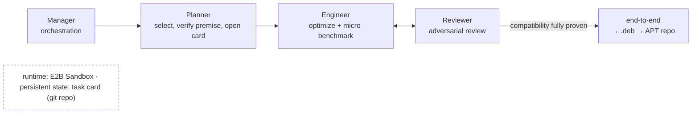

# Linux Development Agent

Let agents work long-term and autonomously on performance optimization for **Ubuntu 26.04**,
producing .deb packages that **speed the system up the moment they are installed** —
with every conclusion adversarially reviewed by another agent.

It is a complete autoresearch flow: agents plan, run experiments and write evidence on task cards
with checkpoints; an independent session reviews them; **a card is done when compatibility is fully
proven, not when a speed-up number looks good**. Clone the repo, plug in your own agent CLI, and run.

> This page is the overview. The full specification is [`FLOW.md`](FLOW.md) · [中文](README.md)

---

## The problem it solves

Getting an agent to optimize code is not hard; getting its conclusions to be **trustworthy** is. Left to
itself, an autonomous agent will write "no difference measured" as "proven harmless", pick its criteria
after seeing the data, declare victory on one lucky run, and quietly change an edge-case behaviour for a
better number. Shipping that into other people's systems would be irresponsible.

LDA's answer is to make trust a property of the process rather than an expectation of the agent. The
convergence criterion is compatibility, not speed; criteria are frozen before any data is seen; every
piece of evidence can be independently recomputed and traced by another agent; anti-cheating checks must
fail on a deliberately broken sample before they count; an unmeasurable gain is a formal result, archived
and not shipped. Inside that structure an agent can run autonomously for a long time, and humans only
revise rules, set priorities and approve releases.

## Six design points

**1. ABI/FFI compatibility is the hardest boundary — and the convergence criterion.**
We optimize real open-source libraries such as libpng, libaio and zlib; the optimized build must be a
**drop-in replacement for the official Ubuntu package**: existing binaries, applications and code need no
change at all. Users keep their Ubuntu and just install it — far more realistic than asking them to switch
systems. "Done" means all eight compatibility checks pass; any interface or behaviour change is a veto.
The eight checks: binary ABI, foreign-function interface, behaviour, configuration, hardware coverage,
system upgrades, security defaults, result equivalence. There is no "faster but slightly less compatible"
deliverable. (FLOW §3)

**2. Two benchmark layers.**
**Micro**: generate varied inputs for each optimized library or function and micro-benchmark it — the
agent's immediate feedback (local reward). **End-to-end**: real applications such as Chrome page rendering,
desktop GUI and web servers verify whether several library optimizations actually turn into system-level
speed-up. The two layers are accounted separately and never compared side by side — a +10% micro does not mean
users will feel it, and a zero end-to-end does not deny the micro. A component card answers for micro
and compatibility only; end-to-end is a recording duty, and the system-level account across several
components is judged by a dedicated integration card. (FLOW §4)

**3. Adversarial verification.**
One agent optimizes, another checks; they must be different sessions, so that no speed-up ever comes at the
cost of changed functionality. The checker recomputes the data independently, traces every job id, and
forges bad samples (fake passes, swapped evidence, edited raw data) to attack the anti-cheating checks —
a check that lets one through is a process defect — and uses git history to verify that criteria were
not loosened after the data arrived. Three verdicts only: confirmed / insufficient evidence, redo /
fraud found, card voided. (FLOW §5)

**4. Prioritized package selection, never the whole archive.**
Ubuntu has hundreds of thousands of packages; we never start by optimizing everything. First filter a small
batch by **usage frequency, performance criticality and importance in the dependency graph** — small
effort, visible generic system-level speed-up, no grinding on a single workload. Each card's premise is
verified before work starts; a false premise kills the card without wasting an optimization round.
Selection itself is a card that runs in the loop, producing candidates and a premise probe for each. (FLOW §6)

**5. Humans change the flow; the flow does the work.**
The human's object of work is the process itself — rules, boundaries, checks. Optimization, testing and
verification are done by agents. When something goes wrong, the first response is not to fix it by hand
but to add the missing rule so the same failure can never pass again. A rule committed to the repo is picked
up by running agents on their next iteration. (FLOW §7)

**6. The whole execution end runs in E2B Sandbox.**
Not just the experiments: **the agent session itself runs inside the box** — the card is shipped in, the
agent works there (writes scripts, runs experiments, commits), the whole card is fetched back, the sandbox
is destroyed. The host only keeps the card's persistent copy and does no computation, so concurrency scales
out horizontally. The execution environment is standardized into one template, **`lda-base`**: build and
packaging toolchain, compatibility and measurement tools, agent runtime, a **preloaded skillset** and agent
harnesses, installed once into a snapshot. Every card clones from the same template in seconds and throws
it away when dirty, never repairing it — identical environments are what make cards comparable. E2B over
Docker because it suits massive concurrency and second-level environment rebuilds. Only workloads a sandbox
cannot host (KVM virtual machines, full GUI sessions, file-sync timing) may run on controlled real hardware,
and the evidence must state why. (FLOW §8)

On top of these, a layer of reinforcements learned from real incidents: every anti-cheating check must
first fail on a deliberately broken sample before it is trusted; criteria are registered before data is
seen; measurements must be paired and alternated, with identical instruments on both arms; "no measurable
gain" is a formal result, archived and not shipped; real gains are classified by cause to decide between
default install and opt-in, and versioning never blocks official security updates. (FLOW §9–§12)

## The task card: unit of work

One optimization task is one **task card**. A card touches one component only (for example the zlib
package family) and has one line of work at a time. A card is a standalone git repository with a fixed
layout:

```
tasks/my-card/
├── .auto/
│   ├── prompt.md        the brief: goal, known premise, definition of every checkpoint, iron rules
│   ├── state/GATES.tsv  checkpoint table: state, evidence path and one-line note per checkpoint
│   ├── rules.json       criteria: thresholds, direction, repetitions — frozen before any data exists
│   ├── checks.sh        anti-cheating checks: evidence fingerprints, gate mapping, referenced paths
│   ├── measure.sh       progress metric: checkpoints passed / remaining
│   └── config.json      iteration cap and other settings
├── evidence/            evidence and raw data (referenced raw data is never deleted)
│   └── HASHES.tsv       sha256 of every evidence file
├── work/                scratch (emptied at close-out)
└── NOTES.md             progress, blockers, what the next iteration should do
```

Checkpoints (gates) are the card's progress scale. A typical optimization card runs: premise check →
micro measurement → ABI comparison → behavioural equivalence → delivery checks → end-to-end record →
close-out. Each checkpoint ends in one of four states: pass, fail, undecidable, not applicable — and "not
applicable" needs a one-line reason; blank and "not applicable" are different things. The card converges
when every checkpoint is terminal and none of the eight compatibility checks has failed.

## What happens in one iteration

`./lda run` drives a card through repeated iterations. In each one:

1. the driver assembles the brief, the current checkpoint table and the latest commits into a prompt and
   hands it to the engine (one agent CLI session);
2. the Engineer reads `FLOW.md` at the repository root and the card's brief, picks a few failing
   checkpoints to advance — writes scripts, runs experiments in the sandbox, writes the results up as
   evidence;
3. any script that produces a number is **committed before it runs**: the criteria enter git history
   before the data is seen, and loosening them afterwards is visible to the reviewer;
4. every step is a git commit; scratch files stay in `work/`, raw data referenced by evidence goes to
   `evidence/` and is fingerprinted;
5. at close-out the checkpoint table is brought in line with the evidence; checkpoints that could not be
   closed get their progress and blockers written into `NOTES.md`;
6. the driver runs `measure.sh` to record progress, stops when every checkpoint is terminal, otherwise
   starts the next iteration.

The loop is interruptible, resumable and session-spanning: when the engine's quota runs out it waits and
resumes from the same checkpoint; a per-card lock guarantees that no card is ever driven by two lines at
once.

## Evidence and measurement discipline

Every piece of evidence has five parts: the command, the key lines of raw output, the job id or artifact
path, why it supports the conclusion, and the job's final state and exit code. Without a scheduled job,
say so explicitly and record the exit code of every step. Evidence files are registered by sha256; the
anti-cheating checks trust fingerprints, not prose — swap a file or edit a number and the fingerprint
no longer matches.

The anti-cheating checks are themselves checked: before any check counts, a deliberately broken sample
(a fake pass, swapped evidence, edited raw data, a reference to a non-existent job) must make it fail.
A check that cannot catch a bad sample does not count.

Measurement has its own iron rules, each learned from a real failure:

- A and B must alternate within the same instance (not alternating fabricates about 5% of "whoever runs
  first is slower");
- measure A, then B, then A again; the effect must be several times the drift;
- both arms use identical instruments — no ad-hoc flags on the control arm;
- a single run under 10 seconds cannot claim a 1%-level result;
- file-sync waits (fsync) are nearly free on a sandbox's layered filesystem, so they may not be
  quantified in a sandbox;
- a zero result is first a reason to suspect the instrument: a known slowdown injected into the control
  arm must be detected, and an empty control must show no difference;
- numbers carry the machine identifier and date; numbers from different machines are never compared
  side by side.

## Review and delivery

Once every checkpoint is terminal, `./lda review` starts an adversarial review in a **new, independent**
session. The reviewer does not summarise; it attacks: recomputes every statistic from raw data and
compares it cell by cell with the card; verifies every job id and file fingerprint; forges at least three
bad samples against the card's anti-cheating checks; uses git history to check that criteria were not
loosened after the fact; goes through the eight compatibility checks one by one. The verdict is written to
`review/VERDICT.md` inside the card, comments are appended to the brief's "review feedback" section
(append-only), and the reviewer never modifies evidence or the checkpoint table.

Three verdicts: **confirmed** / **insufficient evidence, sent back** (gaps listed one by one; the
Engineer reworks and is reviewed again) / **fraud found, card voided**. Every time a reviewer breaks an
anti-cheating check, it becomes a new rule in the specification that running agents pick up on their
next iteration.

A reviewed change is delivered according to its **cause**:

| Cause | Example | Delivery form |
|---|---|---|
| historical conservative default | a wait left for 1990s filesystems, a parameter tuned for long-retired hardware | may enter default install |
| trade-off | more memory for speed, disabling a rarely triggered protection | opt-in only, cost written into the package description |
| hardware-dependent | gain only on a certain CPU instruction set | shipped per tier, or self-selecting at runtime |

"No measurable gain" is a formal result: booked as a zero result, archived, not shipped, with the same
weight as a positive result, so later cards never repeat the detour. The version scheme guarantees an
optimized package never shadows an official security update: when the official security release arrives,
the system upgrade overwrites as usual.

## Runtime model: four roles



| Role | Does |
|---|---|
| **Manager** | interprets operator intent, orchestrates the workflow |
| **Planner** | selects packages by the three-way priority, verifies premises, opens cards |
| **Engineer** | optimizes on the card, runs both benchmark layers, writes evidence |
| **Reviewer** | adversarial review in a separate session: recompute, trace, attack, verdict |

All four roles are played by agents; the Planner that selects packages is itself a card in the loop.
Humans keep three decisions: revising rules, setting priorities, approving releases.

## Quick start

Recommended deployment is a Linux server: your laptop only connects to issue commands and watch; engine
and loops live on the server and keep running when you disconnect; experiments run in an Ubuntu 26.04
environment (an E2B sandbox, a container, or another 26.04 machine).

Prerequisite: an agent CLI installed and logged in on the server (default: subscription Claude Code, no
API key needed).

```bash
# 1) clone + self-check (no model calls, seconds)
git clone <this repo> && cd Linux-Development-Agent-Flow
bash tests/smoke.sh
./lda doctor

# 2) open a card and start autoresearch
./lda new my-card                     # scaffold a task card (tasks/my-card)
$EDITOR tasks/my-card/.auto/prompt.md # write the brief: goal, premise, checkpoints, criteria
                                      # write it yourself or let a Planner agent draft it; see examples/fccache-card
./lda fleet start tasks/my-card       # resident tmux loop: disconnect, close the laptop, it keeps going
./lda fleet status                    # overview; logs: ./lda fleet logs tasks/my-card -f

# 3) when all checkpoints are terminal, adversarial review in a fresh session
./lda review tasks/my-card
```

Rather start from something that runs as-is? `examples/fccache-card` is a real task (fontconfig's
2-second dead wait; it produced the first deliverable): `cp -r examples/fccache-card tasks/`, `git init`
inside, then `fleet start` as above.

No server? `./lda run <card>` runs a single card in the foreground on any machine.

Switching engines is one variable:

```bash
./lda run …                          # default: subscription Claude Code
LDA_ENGINE=pi ./lda run …            # presets: claude | pi | codex (API-based engines)
ENGINE_CMD='<any command>' ./lda run …  # full override; the command must accept the prompt as its last argument
```

Any agent CLI that reads a prompt and works with tools on its own can be the engine; both subscription and
API engines have been run in production. Role prompts live in `prompts/` — edit them directly.

All commands:

| Command | Does |
|---|---|
| `./lda doctor` | self-check: git, python3, engine CLI, and whether an experiment environment is wired up |
| `./lda new <name>` | scaffold a new card from the template (`tasks/<name>`, its own git repo) |
| `./lda run <card> [iterations]` | run the autoresearch loop in the foreground (Engineer role) |
| `./lda status [card]` | checkpoint states and progress; without an argument, an overview of all cards |
| `./lda review <card>` | adversarial review of a card whose checkpoints are all terminal (Reviewer role, separate session) |
| `./lda fleet start <card...>` | run cards resident in tmux — close the terminal or the laptop, they keep going |
| `./lda fleet status / logs / stop` | fleet overview, a card's log, stop a card |

## Sandbox

**The standard environment, `lda-base`** — recipe in `tools/e2b/template/`:

```bash
python3 tools/e2b/template/build.py lda-base   # build the template (minutes, once)
export E2B_TEMPLATE=lda-base                   # every card clones from it
```

It contains Ubuntu 26.04 (with `deb-src` enabled), the build and packaging toolchain (gcc, cmake, ninja,
dpkg-buildpackage, debuild, fakeroot, quilt, patchelf, ccache), compatibility and measurement tools
(abigail-tools, strace, ltrace), the agent runtime (node + Claude Code CLI + pi), and a **preloaded
skillset**: every skill in `skills/` (rebuilding a .deb family, the eight compatibility checks, micro
benchmark discipline, how to write evidence) ships with the template into `/opt/lda/skills`, linked to
`~/.claude/skills`, so an agent can use them the moment it enters the box. Adding a harness is one line in
`harness.txt` (`npm:` / `pip:` / `git:`) plus a rebuild.

**Execution shape** — `./lda run` puts the whole iteration inside a sandbox (`tools/e2b/session.py`):
the card is packed in, the agent works and commits inside, the whole card is fetched back to the host, the
sandbox is destroyed. Evidence is always fetched before teardown, including on failure. `LDA_EXEC=host`
falls back to host execution (for debugging, or without a sandbox service). Batch experiments fan out via
`tools/e2b/fanout.py` (one sandbox per job, built-in heartbeat, hashes checked on both ends). Credentials
come from environment variables only — never in the repository, never in the template.

## Repository layout

```
README.md              overview (this file)
FLOW.md                full specification
lda                    command entry: doctor / new / run / status / review / fleet
tools/autoresearch.sh  loop driver
tools/e2b/             sandbox fan-out driver + environment snapshot recipe
prompts/               role prompts (engineer / reviewer)
templates/task-card/   task card template
examples/fccache-card/ example card: a real Ubuntu 26.04 acceleration task
tests/ + .github/      smoke test (no model calls), runs in CI on push
```

## References

- [Argus](https://github.com/lbx154/Argus) · [arXiv:2608.05144](https://arxiv.org/abs/2608.05144) · [argusbot.cn](https://argusbot.cn/)
