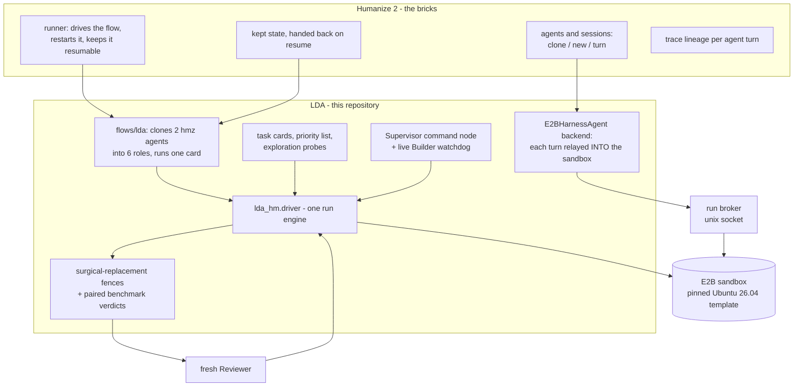
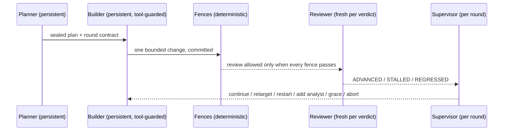
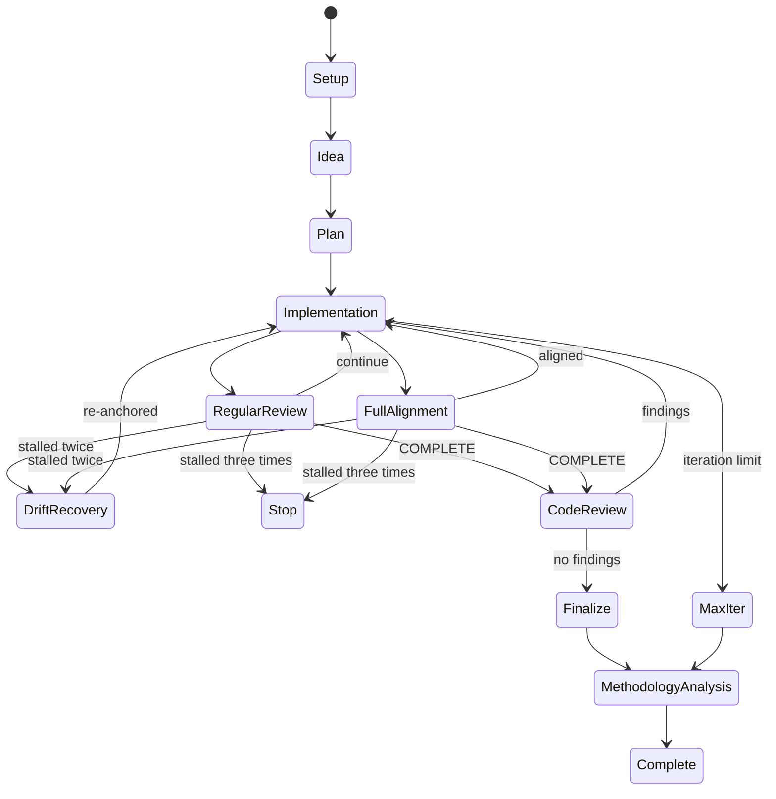

# LDA: Linux Development Agent

[中文版](README.md)

LDA is an agent workflow that develops real performance optimizations for
Ubuntu 26.04 packages — under the constraint that the result must install on a
stock system as a drop-in replacement, with every existing binary and program
still working unmodified.

The agent harness is [Humanize 2](https://github.com/humanfia/humanize2)
(`hmz`): its runner owns the loop, the agent sessions, retries, resumable
state, and trace lineage. This repository is a Humanize *flowverse* — it
contributes everything LDA-specific on top of that harness: the hard
compatibility fences, the two-layer certified benchmarks, the task cards, the
package priority list, and the supervision rules. Every build, test,
benchmark, and agent turn executes inside an E2B sandbox created from one
pinned template; nothing runs on a bare host.

- **Quick start** → [jump](#quick-start)
- **What a run delivers** → [output](#what-the-workflow-delivers)
- **How benchmarks stay honest on a noisy host** → [jump](#benchmarks-on-a-noisy-multi-tenant-host)
- **What each of the ten packages measures** → [jump](#what-each-of-the-ten-packages-measures)
- **What makes an optimization acceptable** → [the surgical-replacement boundary](#the-surgical-replacement-boundary-abiffi)
- **How the workflow is built on Humanize** → [jump](#how-this-workflow-is-built-on-humanize-2)
- **Measured speedups** → [certified results, at the bottom](#certified-results)

---

## What the workflow delivers

A finished card leaves three things in `runs/<run-id>/` under the results
root, archived into this repository's `runs/<run-id>/` by
`tools/archive-run.py`:

| Deliverable | Where | What it is |
|---|---|---|
| **drop-in `.deb` set** | `packages/*.deb` + `SHA256SUMS` | binary packages rebuilt from the pinned Ubuntu 26.04 source with `Package`/`Version`/`Architecture` identical to stock: `dpkg -i` installs them over the stock packages, `dpkg -i` of the stock packages rolls back. This is the surgical replacement itself. |
| **source patch** | `candidate.patch` + `candidate-log.txt` | the git diff against the pinned source package; applied in a fresh sandbox it rebuilds the same `.deb` set (certification does exactly that) |
| **evidence bundle** | `benchmark-summary.json`, `certification-summary.json`, `rounds/`, `raw-traces/*.jsonl.gz`, `finalize-summary.md`, `speedup-report.md` | paired benchmarks (train + hidden holdout), fresh-sandbox re-certification, per-round fences and verdicts, the complete stream-json trace of every agent turn, and the mechanism report |

A speedup without a `.deb` is not delivered; a `.deb` without its traces is not certified.

## The surgical-replacement boundary (ABI/FFI)

This is the hardest fence in LDA and the reason the project is shaped the way
it is. An optimized package must be installable on a stock Ubuntu 26.04 system
with `dpkg -i`, and every existing binary, program, and development workflow
must keep working **without being rebuilt or modified**. Users of Ubuntu
should be able to install our library and get the speedup — not migrate to a
different distribution or recompile their applications.

Because that promise is easy to state and easy to break, it is enforced
mechanically per candidate, before any reviewer is consulted:

| Fence | What is required |
|---|---|
| Shipped library set | the candidate debs ship exactly the baseline's shared libraries — same names, no additions, no removals |
| SONAME & ELF identity | class, endianness, OS/ABI, machine and type equal; SONAME never changes |
| Dynamic symbol table | exported symbols and their versions equal to stock, entry for entry |
| Type-level ABI | `abidiff` with debug info (dbgsym) reports no difference |
| NEEDED set | the candidate links against the same libraries the baseline did |
| Package relationships | Package, Version, Architecture, Depends, Pre-Depends, Provides, Breaks, Conflicts byte-equal, so `apt` treats the replacement exactly as it treats stock |
| FFI proof | a consumer binary compiled **once against the baseline** runs unmodified against the candidate, with identical output |
| Behavior | every fixture decodes / renders / parses to byte-identical results through baseline and candidate |
| Package lifecycle | the candidate installs over stock on a live system, a compiled consumer still runs, and stock rolls back cleanly |
| Security hardening | RELRO, non-executable stack, no TEXTREL/RPATH, Build IDs survive |
| Upstream tests | the package's own suite runs during the candidate rebuild and the build log must prove it (a packaging that visibly disables its tests is recorded as not-applicable, never assumed to have passed) |
| autopkgtest | the package's `debian/tests` run against the installed candidate; every test that passed on baseline must pass again |
| Trace audit | the Builder's own recorded actions are audited for evidence tampering (see [supervision](#supervision-the-command-layer)) |

**A speedup never compensates for a fence failure.** This is what keeps the
optimizations honest: the only way to make the numbers move is to make the
code faster, because every route that would fake it is closed by a fence.

Practical consequences for how the agent is allowed to optimize:

- Architecture-specific code is fine, but it must be reached by **runtime
  dispatch** (one-time CPUID / `target_clones`) with the generic path kept, so
  the same deb stays correct on any x86-64 host.
- New fast paths must keep symbols **hidden**; adding an exported symbol
  breaks the symbol-table fence.
- Compiler-flag work (LTO, unrolling) is allowed only where it does not change
  the exported ABI — and is measured, not assumed (see the cairo row in the
  results table: re-enabling LTO measured real but sub-threshold).

## Two-layer benchmarks

Every performance claim is measured at two layers, because a library
micro-benchmark alone does not prove a user-visible win:

- **Micro** — workloads that exercise the optimized library's own code
  directly. This is the Builder's local reward signal. The inputs the Builder
  can see are the *train* set.
- **End-to-end** — a real consumer path that goes *through* the library, to
  check the micro win survives in an application. The e2e workloads in this
  repository are the real consumers of each target: cairo PNG-surface loading
  and gdk-pixbuf decoding for libpng, the cairo rendering stack for libcairo2,
  GObject-introspection churn for GTK, an HTTP round trip for libsoup, and
  `getent` through NSS for sssd.

Certification additionally requires the declared margin on a **hidden
holdout** generated from a host-held seed the Builder has never seen, and a
replay in **fresh sandboxes**. See
[benchmarks on a noisy multi-tenant host](#benchmarks-on-a-noisy-multi-tenant-host)
for the noise policy, which is the part that took the most iteration.

## How this workflow is built on Humanize 2

`hmz` is the brick; LDA is the building. The generic agent machinery is never
re-engineered here, which is why extending the flow to a new package family is
a workbench script plus a card profile, and swapping the model or agent
backend is a flag rather than a rewrite.

**What Humanize owns**

- the **runner**: drives the flow, restarts it, and keeps it resumable
- **agents and sessions**: `clone` / `new` / turn execution, and the failure
  semantics of a turn
- **kept state**: a per-workspace-cycle `state` dict handed back on resume
- **trace lineage** per agent turn (`hmz trace collect` sees the whole run)

**What LDA contributes**

| Seam | File | What it does |
|---|---|---|
| Flow declaration | `flows/lda/__init__.py` | a `@flow(resumable=True)` that receives two hmz agents (`builder`, `reviewer`) plus hmz's kept `state`, and runs one task card |
| Role fan-out | `src/lda_hm/hmz_glue.py` | clones the two handed agents into the **six** LDA roles and wraps them in the engine's Agent/Session protocol |
| Agent backend | `src/lda_hm/hmz_backend.py` | an `AgentBase` / `CommandSessionBase` whose every turn is relayed **into the card's E2B sandbox** |
| Relay | `src/lda_hm/hmz_relay.py` | one host-side process per turn: pushes the prompt in, runs the in-sandbox agent CLI, prints the reply |
| Sandbox broker | `src/lda_hm/broker.py` | the flow process lends its live sandbox connection to relay processes over a unix socket, so one sandbox serves every role |
| Run engine | `src/lda_hm/driver.py` | the LDA loop itself: setup, rounds, fences, benchmarks, finalize |

Because the backend is an ordinary hmz agent backend, an in-sandbox LDA turn
looks to hmz like any other agent turn — so model credentials stay
sandbox-resident (the relay carries none), the role an agent plays is just its
hmz name (`clone(name="builder")`), and the whole run remains visible to hmz's
tracing. `hmz_glue.py` deliberately never imports hmz: it talks to the agents
through their public surface only, so the engine tests can drive the same code
with stubs.



## Roles: persistent writers, fresh readers

The two agents hmz hands the flow are cloned into six named roles. Writers
keep their context because they must continue unfinished reasoning; readers
start fresh because independence is part of the review boundary.

| Side | Role | Session | Job |
|---|---|---|---|
| builder | Drafter | persistent | produce the idea draft |
| builder | Planner | persistent | revise the candidate plan, seal it |
| builder | Builder | persistent | one bounded change per round, tool-guarded |
| reviewer | Analyst | fresh each reading | independent diagnosis when the run is stuck |
| reviewer | Reviewer | fresh each verdict | rule on the evidence after fences pass |
| reviewer | Supervisor | per round | steer the run from its own evidence |



## One run of a card

1. **Explore** (before any card exists): `lda explore <package>` measures a
   stock workload in a fresh sandbox, attributes cycles with `perf`, and
   writes an honest feasibility verdict — *including falsification* when the
   hot code turns out to live in another package. This is what keeps the
   project from burning runs on a package it cannot move.
2. **Setup**: sandbox from the pinned template; the recorded APT snapshot is
   the only package source; the installed set is aligned to that snapshot; the
   exact source version is fetched and committed as the baseline; the fence
   self-checks must flag known-bad samples before any verdict is trusted.
3. **Rounds**: a persistent Builder makes one bounded change per round (an
   in-turn tool guard blocks evidence tampering as it happens); fences and
   paired benchmarks judge the round; a fresh Reviewer rules on the evidence;
   the Supervisor steers.
4. **Finalize**: the whole result replays in fresh sandboxes from the
   immutable template — setup from the snapshot, patch re-applied, every fence
   re-run, fresh-seed holdout — before anything is called certified.



## Benchmarks on a noisy multi-tenant host

E2B sandboxes share hosts with other tenants, so the benchmark policy is
designed to make noise **visible and non-exploitable** rather than to pretend
it away. Every rule below exists because noise broke a run first:

- all timing is taken **inside** the sandbox by the workload script and tagged
  with a per-invocation nonce the measured process cannot see; host wall time
  is never judged;
- baseline and candidate **alternate within one sandbox**, per repetition, so
  host drift cancels inside each pair;
- one repetition runs for **seconds**, not tens of milliseconds — process
  start-up and scheduler jitter must be negligible next to the effect;
- a speedup certifies only when the **95% Student-t interval** on
  per-repetition log ratios excludes 1.0, the declared minimum is cleared, and
  fewer than three repetitions never certify;
- **co-tenant CPU steal above 10%** of any sample invalidates the run itself
  (one retry, then an infrastructure block — the candidate is not blamed); a
  spread wildly out of proportion to the effect is treated the same way;
- the micro inputs the Builder can see are the train set; certification also
  requires the declared margin on a **hidden holdout** from a host-held seed;
- before certification is trusted on a host, the baseline is measured against
  itself (an **A-A null run**): a harness that resolves an effect where none
  exists is a false-positive generator and its verdicts are refused;
- **fixed-rule extension**: a candidate whose point estimate clears the
  target while the paired t-interval still spans 1.0 is under-sampled, not
  refuted: up to two more blocks of the card's repetitions are added and the
  verdict is taken on the pooled sample (`LDA_BENCH_EXTENSION_BLOCKS`). The
  rule lives in code, never with the Builder: a candidate below target gets
  no extension, and the pooled interval must exclude 1.0 on its own.
- **installed-state A/B**: packages whose typelibs, private library
  directories or data are loaded by absolute path (gnome-shell,
  gnome-settings-daemon, LibreOffice, sssd) get each side's own `.deb` set
  installed with `dpkg -i` outside the timed region, so what is measured is
  what a user installs, not an `LD_LIBRARY_PATH` approximation.
- **attribution before timing**: every workbench first proves the timed code
  comes from the side under test (loaded `.so` paths, sha256 of installed
  files, plugin file names), and each card records with `perf` the share of
  timed cycles spent in the package's own code before the card opens: a
  package with a small share earns an honest "cannot be moved" rather than a
  number inside the noise.
- **finalize replays in fresh sandboxes** that land on other hosts, so a
  speedup that only existed on one machine does not certify.

Measurement capability of the sandboxes (probed and recorded per run): the
Firecracker guests expose no PMU — `cycles` is unsupported — so profiling uses
software sampling (`linux-perf` from the pinned snapshot). The target CPU
(Intel Xeon Gold 6548Y+, Emerald Rapids) reports the full AVX-512/AMX flag
set, and architecture-specific work targets those flags behind runtime
dispatch so the package stays correct anywhere.

## What each of the ten packages measures

Every micro workload spends its timed cycles in the package's **own** code,
runs for seconds per repetition, hashes its output byte for byte, and gets a
hidden holdout regenerated from a host-held seed; every e2e is a real consumer
path through the package. "Own share" is the baseline's self-cycle share
recorded with `perf cpu-clock` before the card opened; it is the ceiling a
package has under these fences.

| Package | micro (the Builder's local reward) | e2e (real consumer path) | Own share |
|---|---|---|---|
| libgtk-4-1 / libgtk-3-0t64 | compiled dlopen workbench: CSS parsing, selector matching, full-tree layout | GObject-introspection churn | high (gtk's own machinery) |
| libcairo2 | dashed bezier stroking, self-intersecting fills, corpus text paths | cairo stack PNG load | high (pixman/libz excluded) |
| libsoup-3.0-0 | HTTP header parsing: quality lists, parameter lists, case-insensitive lookups | local HTTP round trip | high |
| sssd-common | seeded NSS lookup table through an installed proxy-files domain | fresh-process `getent` | medium (responder + client) |
| gstreamer1.0-plugins-good | package-owned video filters (videoflip/balance/gamma/median/box/crop), effectv effects, integer audio effect chain; per-side plugin farm and private registry | WAV→FLAC transcode + MJPEG-in-AVI capture-style encode | 42–48% |
| libreoffice-core | seeded ODF corpus (long Writer documents, Calc sheets whose formulas carry no cached values) → PDF in one batched soffice call | DOCX/XLSX export and re-import | ~40% (libmergedlo + sal) |
| gnome-shell | full headless shell startup: mutter headless backend, GNOME's own mock-session runner and test tool, automation script exiting once the shell is ready | overview shown/hidden three times after startup | ~3% C (the rest is the shell's own JS in gjs plus software rendering) |
| gnome-settings-daemon | each plugin from start to owning its `org.gnome.SettingsDaemon.*` bus name on private buses (dbusmock logind/UPower/NM/polkit/gnome-session) | all plugins started in parallel, the way gnome-session does | low (startup path) |
| ibus | registry: seeded component corpus (~280 components, ~11k engine descriptions) written to cache and read back | daemon key session: 12k key events through the simple engine (compose sequences included) | ~1–2% (GLib/IPC dominated) |

The share column is an honest ceiling: for gnome-shell and ibus, recompiling the
package's C code can barely move the timed path; any speedup has to come from
their own startup logic (JS, configuration, serialisation), and the fences judge
it just the same.

## Supervision (the command layer)

Authority is fixed: **human control file > deterministic rules > LLM
counsel.**

- A **live watchdog** reads the Builder's growing trace during a turn, mirrors
  it to the host (so an agent cannot rewrite its own history), and kills a
  stalled agent process after double confirmation — a watchdog that cannot
  observe never kills. Every turn is independently wall-clock bounded inside
  the sandbox (`LDA_TURN_TIMEOUT`, default 4200s), so a runaway agent cannot
  outlive its relay.
- Between rounds the **Supervisor** assembles a pulse from the run's own
  evidence (verdicts, blocks, benchmark trend, trace statistics, sandbox load,
  spend) and emits one auditable decision: continue, retarget,
  restart the Builder, consult an independent Analyst, grant a one-per-run
  grace for an improving near-miss, or abort. An LLM supervisor is consulted
  only when the run is off-track; a malformed answer degrades to the rule
  decision, and an **LLM abort is demoted to retarget** — only humans and hard
  rules may end a run.
- `<run>/control.json` is the **human channel**, re-read at every phase
  boundary: `{"action": "abort"}`, `{"contract": "..."}`,
  `{"action": "restart_builder"}`.
- **Infrastructure failures never count against the candidate.** A Builder
  turn killed by a model-gateway outage, a Reviewer answer that is a transport
  error, an unstable benchmark window — each is recorded as an infrastructure
  block that consumes no stall budget and no iteration budget. Three in a row
  **pause** the run (state saved, sandbox released, exit 75) instead of ending
  it, and the driver loop resumes it: an outage that lasts an afternoon must
  not lose a card.
- The Builder-trace audit judges what the agent **did** — executed commands
  and edited paths — never what it said: prose legitimately quotes the very
  patterns a cheating command would contain. A session whose trace fails audit
  is replaced with a fresh session (clean trace, stall retained).

## Package priority: what to optimize first

Optimizing tens of thousands of Ubuntu packages is not a plan, so candidates
are ranked from the Ubuntu 26.04 desktop ISO's own dependency graph
(`data/candidates-ubuntu-2604.json`, surfaced by `lda candidates`).

The ISO manifest carries 1,814 Debian packages, 1,811 of which match the
Packages index exactly; the resulting graph has 12,369 edges, of which 8,401
are required (`Depends` + `Pre-Depends`). Candidates are filtered to packages
that are required by at least 5 others, have at least 3 required dependencies
of their own, and are not `oldlibs` or `required`-priority core libraries — so
`libc6`, `libgcc-s1` and `libstdc++6` deliberately do not appear. The score
combines fan-in (reuse, 0.40), required out-degree (layer position, 0.35) and
dependency surface (0.25), times a priority factor. **The score is a
prioritization proxy only — it says nothing about code quality or known
defects.**

Two directions come out of it: mid-layer UI/media infrastructure that many
components reuse (GTK, cairo, GStreamer, pango, gdk-pixbuf, libtiff,
libpulse), and high-layer desktop/system components with a wide direct
dependency surface (gnome-shell, LibreOffice, sssd, ibus, polkitd,
cups-filters). Current per-package verdicts are in the
[top-10 status table](#top-10-status) at the bottom.

## Quick start

Requirements: Python **≥ 3.12** (hmz requires it), access to an E2B cluster,
and credentials for a Claude-compatible model gateway.

```bash
git clone -b LDA-HM https://github.com/yisun219/Linux-Development-Agent-Flow.git lda
cd lda

# 1. one-time environment: the hmz harness, the E2B SDK, and this repository
python3.12 -m venv ~/.venvs/ldahm
~/.venvs/ldahm/bin/pip install "git+https://github.com/humanfia/humanize2.git" e2b
~/.venvs/ldahm/bin/pip install -e .          # provides the `lda` command
export PATH="$HOME/.venvs/ldahm/bin:$PATH"

# 2. sanity check: 117 engine tests, no sandbox and no model calls needed
python -m unittest discover -s tests         # expect: OK
bin/lda-hmz check                            # expect: drives: ('builder', 'reviewer')

# 3. E2B access, kept out of the repository (loaded automatically, chmod 0600)
install -d -m 700 ~/.config/lda-hm
cat > ~/.config/lda-hm/e2b.env <<'EOF'
E2B_API_URL=https://your-e2b-endpoint
E2B_SANDBOX_URL=https://your-e2b-endpoint
E2B_API_KEY=your-e2b-key
EOF
chmod 600 ~/.config/lda-hm/e2b.env

# 4. build the pinned lda-base template once (Ubuntu 26.04 + toolchain +
#    agent harness + the skills that ship into every sandbox)
python sandbox/build_template.py

# 5. model credentials for the in-sandbox agent CLIs. They are injected only
#    when a sandbox boots; the host-side relay processes never carry them.
export ANTHROPIC_BASE_URL=https://your-model-gateway
export ANTHROPIC_AUTH_TOKEN=your-token
```

Then run the workflow:

```bash
# what is worth optimizing, ranked from the ISO dependency graph
lda candidates

# measure a candidate before spending a run on it (no agent turns)
lda explore libsoup-3.0-0 --results-root ~/lda-runs

# open a card and run the full flow under the hmz harness
lda gen-card libsoup-3.0-0 --out examples/libsoup3-card.json
lda init-card ~/lda-work-soup examples/libsoup3-card.json
LDA_RESULTS_ROOT=~/lda-runs bin/lda-hmz-drive ~/lda-work-soup soup-production-001
```

On a Slurm cluster `tools/slurm/run-card.sbatch` wraps the same thing as a
job (the host side only orchestrates: 2 cores, 6 GB; `LDA_AGENT_BACKEND=claude|codex`
selects the agent backend, `LDA_TASK_FILE` carries the card's task hint):

```bash
sbatch --export=ALL,PKG=libcairo2,WORKSPACE=~/lda-work-cairo,RUN_ID=cairo-001 \
       tools/slurm/run-card.sbatch
tools/archive-run.py ~/lda-runs/runs/cairo-001     # afterwards: evidence + traces into runs/
```

`bin/lda-hmz-drive` is the production entry point: it keeps one run alive
across transient failures. **Interrupting a run loses nothing** — starting the
same command again resumes from the state hmz kept, and an infrastructure
outage parks the run rather than ending it.

Useful knobs:

| Knob | Effect |
|---|---|
| `<run>/control.json` | steer a live run (`abort`, `restart_builder`, new `contract`) |
| `LDA_RESULTS_ROOT` | durable evidence repository, separate from flow source |
| `LDA_BUDGET_USD` | spend cap for the run |
| `LDA_CERT_REPLICATIONS` | fresh-sandbox certification replications (default 2) |
| `LDA_TURN_TIMEOUT` | wall-clock bound on one agent turn (default 4200s) |
| `LDA_AGENT_MODEL` | model for both sides (default `claude-opus-4-8`); `LDA_AGENT_MODEL_REVIEWER` overrides the reader side |
| `LDA_AGENT_BACKEND` | in-sandbox agent CLI: `claude` (default) or `codex`; per role via `LDA_AGENT_BACKEND_REVIEWER` |
| `LDA_BENCH_EXTENSION_BLOCKS` | how many repetition blocks an under-sampled candidate may add (default 2) |
| `lda trace <run-dir>` | render a run's behavioral timeline |
| `tools/e2b/reap-sandboxes.py` | collect sandboxes a SIGKILL'd driver could not release |

## Repository layout

```text
flows/lda/           the flow the hmz runner executes
src/lda_hm/
  driver.py          one run engine shared by both entry points
  hmz_glue.py        hmz agents -> LDA roles and the engine protocol
  hmz_backend.py     hmz agent backend: turns relayed into the sandbox
  hmz_relay.py       one relay process per agent turn
  hmz_launcher.py    `bin/lda-hmz`: builds the agents, calls hmz's Runner
  broker.py          the flow process lends its sandbox connection
  execution.py       E2B lifecycle, integrity pinning, certification
  fence.py gates.py  deterministic boundary before any reviewer
  benchmark.py       paired statistics, nonce samples, Student-t policy
  supervision.py     Supervisor rules, run pulse, Builder watchdog
  explore.py         pre-card feasibility probes for ranked packages
  cardgen.py         task-card generator for profiled candidates
  candidates.py priority.py   the ranked list and its scoring
sandbox/lda-base/    template recipe: Dockerfile, checks, harness, skills
examples/            generated task cards (all top-10 plus libpng)
runs/                archived runs: evidence, candidate patch, .deb checksums, agent traces (gzip)
tools/               archive-run.py, slurm/run-card.sbatch, e2b/reap-sandboxes.py
data/                ranked top-30 candidates from the ISO dependency graph
tests/               117 engine and card tests (no model calls, no sandbox)
docs/FLOW.md         flow mechanics in depth
docs/BASELINE.md     baseline capture and snapshot alignment
```

The skills shipped into every sandbox (`sandbox/lda-base/skills/`) use the
`<name>/SKILL.md` layout and are linked into the agent's skill path at
bootstrap, so the Builder actually loads them: the LDA fence, micro-benchmark,
end-to-end-benchmark and adversarial-review contracts, the measured libpng
lessons (including the validated patch), and the pinned Intel performance
skills.

## Development

```bash
python -m unittest discover -s tests -v   # 117 tests, no model or sandbox needed
bin/lda-hmz check                         # verify the flow declaration
```

---

# Certified results

Every number below comes from paired in-sandbox benchmarks, held on a hidden
holdout the Builder never saw, re-certified in fresh sandboxes, with the full
ABI/FFI surgical-replacement fence suite green. Evidence lives in the run
directories under the results root.

## libpng16-16t64 — certified

**Run `libpng-2604-production-008`, COMPLETE (2026-08-28).**

| Layer | Result |
|---|---|
| Micro (train) | **+6.77%** decode |
| Micro (hidden holdout) | **+6.76%** (95% CI on ratio 0.9323–0.9419, 7 repetitions, max steal 0.16%) |
| End-to-end | **+12.40%** on the cairo PNG-to-surface stack |
| Fresh-sandbox re-certification | +6.68% / +6.95% micro, +12.44% / +11.48% e2e in 2 fresh sandboxes with fresh-seed holdouts |
| Fences | 10/10 green; independent code review 0 findings |
| Drop-in check | the deb installs over stock `libpng16-16t64` 1.6.57-1 on a live system and rolls back cleanly |

**How it was accelerated.** The SSE4.1 Paeth unfilter replaces the SSE2
multi-op abs/select emulation with `pabsw` + `pblendvb`, plus an SSE2 Up-filter
row (`-O2` never autovectorizes that byte loop). Reached through one-time
CPUID dispatch, with hidden symbols and the SSE2 fallback kept.

**Why it is faster.** The same per-row filter recurrence retires in fewer uops
on the target Xeon. It is byte-exact by construction: the blend mask comes from
`cmpeq`, so the selection is the same one the scalar code makes.

**Why it stays drop-in.** Dispatch is internal and the new code is hidden, so
SONAME, the dynamic symbol table and `abidiff` are all untouched — which is
exactly why it can be shipped to an existing Ubuntu system.

**A finding worth recording:** Ubuntu 26.04's gdk-pixbuf 2.44 decodes PNG via
`glycin` (Rust), so libpng work **cannot** move the pixbuf path (0% ± 0.7% over
6 measurements). `cairo_image_surface_create_from_png` is the real desktop
libpng consumer, and that is where the +12.4% lands. Chasing the pixbuf path
would have produced a true micro win with no user-visible effect.

## Measured but not yet certified

**libsoup-3.0-0**: +8.0% train / +7.4% hidden holdout on the header-layer
micro — forward-order list building without the `g_slist_reverse` walk, and
quality-list parsing without the intermediate GSList+strdup churn;
allocation-count-neutral, byte-identical output. The run ended on a trace-audit
false positive (the audit was scanning prose; fixed — it now reads only
executed actions) before certification could run. Re-run queued.

## Top-10 status

Campaign `claude-0902-top10` (from 2026-09-02): all ten cards run through the
same workflow on Slurm, agent backend Claude (claude-opus-4-8), one E2B sandbox
per card; per-run evidence lands in `runs/`. The table is updated as runs are
harvested; until a certified result exists, the status column is the status.

| # | Package | Score | Run | Status | Mechanism / verdict |
|---|---|---|---|---|---|
| 1 | libgtk-4-1 | 71.50 | `gtk4-c0902-001` | running | known start: flags alone (-O3 -mtune) measured +1.73%, below the 2% gate; needs a source-level CSS parse/match mechanism on top |
| 2 | libgtk-3-0t64 | 69.42 | `gtk3-c0902-001` | running | an earlier uncertified run measured +3.55% micro / +1.72% e2e |
| 3 | gnome-shell | 64.28 | `gnome-shell-c0902-001` | running | full headless startup; ~3% own C share, ceiling is the shell's own JS startup logic |
| 4 | libreoffice-core | 63.34 | `libreoffice-c0902-001` | running | full package build takes hours (~56 GB build tree); one round per day |
| 5 | sssd-common | 60.69 | `sssd-c0902-001` | running | client mmap decoder route measured −0.2% (excluded); profile first |
| 6 | libcairo2 | 60.20 | `cairo-c0902-001` | running | re-enabled LTO measured +1.38%; needs a second, additive mechanism |
| 7 | gnome-settings-daemon | 59.67 | `gsd-c0902-001` | running | plugin start to name ownership; low own share on the startup path |
| 8 | gstreamer1.0-plugins-good | 59.55 | `gst-good-c0902-001` | running | package-owned filters/effects/audio effects carry the timed work (42–48%) |
| 9 | ibus | 57.77 | `ibus-c0902-001` | running | registry + key session; ~1–2% own share |
| 10 | libsoup-3.0-0 | 54.01 | `soup-c0902-001` | running | mechanism proven (header parsing +8.0% / holdout +7.4%); this run certifies it |

"Falsified" is a deliberate, useful outcome: the exploration proved that
recompiling *that* package cannot move the measured hot path because the hot
code lives elsewhere. Recording it costs one probe and saves a whole run, and
it is why the certified numbers above deserve to be taken at face value.
