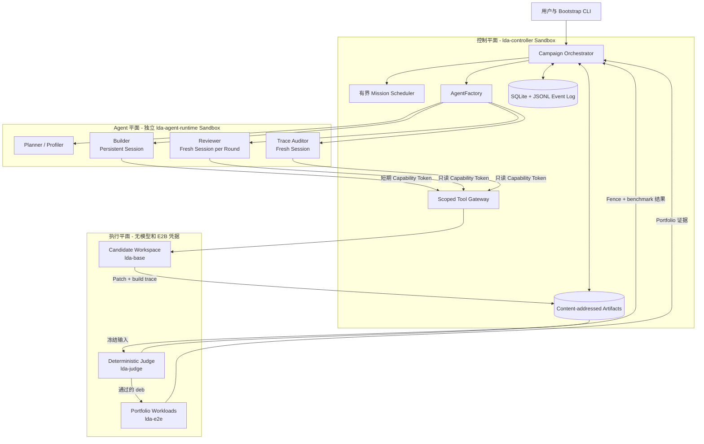
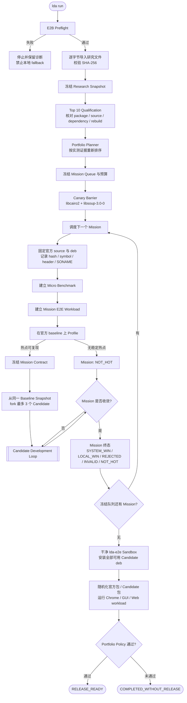
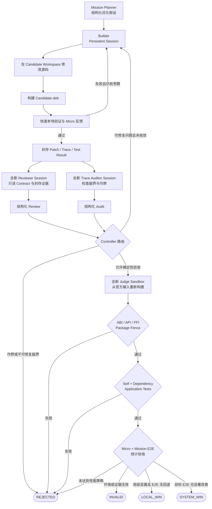

# Linux Development Agent

Linux Development Agent（LDA）是一套运行在 E2B Sandbox 中的多 Agent Linux
性能开发系统。当前目标是自动研究、实现并验证 Ubuntu 26.04 library/package
优化，最终产出能够原位替换 Ubuntu 官方包的 `.deb`。

LDA 的第一原则不是“跑分快”，而是“手术刀式替换”：现有 binary 不重新编译，
现有源代码和头文件使用方式不修改，动态链接和 FFI 调用不改变。只有 ABI、API、
FFI、功能、Debian 包关系和反作弊检查全部通过后，性能结果才有资格参与验收。

## 核心设计原则

### 1. ABI / API / FFI 是最硬的边界

LDA 面向的是 Ubuntu 官方 package 的原位优化，而不是要求用户迁移到另一套系统。
以 `libpng`、`libaio` 等 library 为例，Candidate 必须满足：

- 已有 binary 不重新编译即可继续运行；
- 已有 C/C++ 源码、头文件 include 方式和编译参数不需要修改；
- 动态链接名称、SONAME、exported symbol 和 symbol version 不改变；
- public struct/union 的 size、alignment、field offset 和 calling convention 不改变；
- Python、Rust 和其他语言的 FFI 调用不改变；
- pkg-config、CMake metadata、安装路径和 Debian package relationship 保持兼容；
- Candidate 能构建为 `.deb`，直接替换官方包，并能可靠回滚到官方包。

这些条件是硬 Fence，不是 Reviewer 的主观建议。任何一项失败，Candidate 立即被
确定性 Judge 拒绝；即使 Benchmark 更快，也不会进入性能验收。

### 2. Micro Benchmark 与 End-to-End Benchmark 分层

LDA 不用单一 Benchmark 同时承担局部优化反馈和系统价值证明：

| 层级 | 测量对象 | 作用 | 验收含义 |
| --- | --- | --- | --- |
| Micro | 单个 library、function 或 hot path，多种 input size、数据分布、cache 和线程模式 | 给 Builder 提供局部 reward，快速判断一个优化假设是否成立 | 显著提升且兼容 Fence 全通过，才可能成为 `LOCAL_WIN` |
| Mission E2E | 使用该 package 的真实 consumer，例如页面渲染、HTTP 请求、GUI 启动或媒体 pipeline | 检查局部优化是否影响真实应用，并阻止功能或性能回归 | 无明显回退是 `LOCAL_WIN` 的必要条件；显著贡献才可能成为 `SYSTEM_WIN` |
| Portfolio E2E | 同时安装多个已通过 Candidate `.deb`，运行 Chrome/Chromium、GUI、Web server 等系统 workload | 验证多个局部优化是否真的形成 generic system-level speedup | 只有这一层通过，默认 Release 才能进入 `RELEASE_READY` |

Micro speedup 不能直接相加，也不能代替真实应用验证。每层都保存原始样本、执行顺序、
硬件与系统信息，并使用随机化 A/B 顺序、paired ratio 和 bootstrap 95% CI。

### 3. Builder、Reviewer、Trace Auditor 与 Judge 相互独立

LDA 把“实现优化”和“证明优化有效”分开：

- Builder Agent 持续维护一个 Candidate，负责 Profile、修改、构建和有限次数修复；
- Reviewer Agent 每轮使用全新 Session，只读取冻结 Contract、Patch、测试、Benchmark
  和 Trace，看不到 Builder 对话，也不能修改源码；
- Trace Auditor 使用独立 Session，检查越界写入、测试污染、Benchmark 操纵和作弊；
- Judge 不是 Agent，不使用 LLM，只执行固定的 ABI/API/FFI、功能、package 和统计规则。

因此“一个 Agent 做、另一个 Agent 检查”不仅体现在 Prompt 上，还通过 Session 隔离、
只读工具权限和全新 Judge Sandbox 强制实现。Reviewer 或 Builder 声称完成都不会改变
Candidate 状态，只有确定性 Judge 和 `ConvergenceEvaluator` 拥有终止权。

### 4. 先筛选少量高价值 Package

LDA 不会直接遍历 Ubuntu 的全部 package。Research Snapshot、APT dependency graph、
reverse dependency、真实 Profile、安装/使用证据、构建成本和 ABI 风险共同产生候选，
再使用以下归一化公式排序：

```text
priority
= 0.25 * usage_frequency
+ 0.25 * measured_cpu_share
+ 0.20 * dependency_centrality
+ 0.15 * workload_generality
+ 0.15 * expected_effort_efficiency
- compatibility_risk
```

第一阶段只冻结 5 到 10 个 Mission。依赖图排名只是候选证据；每个 package 必须先完成
Qualification，证明官方版本可重建、存在可复现热点、能够建立 Micro/E2E workload，
并有机会构建 drop-in `.deb`，才会进入 Builder 阶段。这样优先寻找工作量可控、复用面
较广、能够产生通用系统收益的中间层和高层组件，而不是围绕单一 workload 无限优化。

### 5. 执行端完全 E2B 化

源码获取、build、Profile、测试、Benchmark、环境恢复、Candidate fork、Agent Session、
Judge 和 Portfolio E2E 都通过 E2B API 执行。本地 CLI 只负责 bootstrap 和运行管理，
不会在 E2B 失败时静默改用 Docker 或裸机。

公共依赖、编译器、ABI 工具、Benchmark harness 和固定 Skillset 被预装进版本化 Template，
再通过 Snapshot/fork 快速创建隔离环境：

| Template | 预装内容与边界 |
| --- | --- |
| `lda-controller` | 多 Mission Agent Harness、Scheduler、状态恢复、Artifact、Tool Gateway 和 E2B 生命周期管理 |
| `lda-agent-runtime` | Codex CLI/SDK、Agent Runner、JSON Schema、只读角色 Prompt 和 Intel Performance Skills |
| `lda-base` | Ubuntu 26.04 编译环境、Debian package 工具、perf/trace/ABI/FFI 工具、Benchmark/self-test/dependency-test harness 和 Intel Skills |
| `lda-judge` | 从 `lda-base` 派生的 immutable Fence runner；没有 Codex、模型凭据或 E2B Key |
| `lda-e2e` | 干净 Ubuntu 26.04、Chromium、Playwright、Web/GUI fixture 与 `.deb` A/B/rollback harness |

Agent Harness 与编译 Workspace 分成不同 Template，是为了避免 Agent 或 Workspace 获得
Controller 凭据，同时仍让 `lda-base` 预装执行优化所需的全部工具和检查脚本。Controller
使用 `AsyncSandbox`、全局 Semaphore、lease metadata、Snapshot/fork 和 orphan reaper，
支持大规模并发、快速重建和中断恢复。

### 6. 针对 Xeon Gold 6548Y+，但保持公共兼容性

当前 E2B 执行节点的目标 CPU 是 Intel Xeon Gold 6548Y+。每次 Benchmark 都通过
`lscpu`/CPUID 重新确认硬件，并记录 kernel、microcode、governor、turbo、NUMA 和负载。

`lda-base` 和 `lda-agent-runtime` 内置固定 commit 的
[Intel Performance Skills](https://github.com/intel/intel-performance-skills)，至少包括：

- `linux-perf`：Profile、PMU 和热点定位；
- `performance-patterns`：SIMD、runtime dispatch、cache、锁和并发优化模式；
- `phoronix-test-suite`：标准 workload 与性能测试组织方式。

针对 6548Y+ 可以实现 AVX2、AVX-512、IFUNC、function multiversioning 或 CPUID runtime
dispatch，但公共 drop-in package 禁止全局使用 `-march=native`。非目标 CPU 必须自动
选择兼容 fallback，否则 ABI Fence 通过也仍会被兼容性策略拒绝。

### 7. Fence 同时覆盖功能、依赖和作弊

Judge 在干净 E2B Sandbox 中从固定 Ubuntu Snapshot 重新获取官方源码和 `.deb`，核对
SHA-256，从头构建 Candidate package，然后按固定顺序执行：

```text
Level 0: 官方 upstream self tests
Level 1: ABI / API / FFI 与 Debian package compatibility
Level 2: 原有预编译 binary + Candidate library
Level 3: 直接 reverse dependency 的 build/test
Level 4: 高优先级应用 install/launch/smoke
Level 5: Chrome、Web server、GUI 等 End-to-End workload
```

Self test 保证 library 自身功能没有被破坏；dependency test 验证原有消费者仍能编译、
链接和运行；E2E 验证系统级行为。与此同时，Trace 记录命令、文件、进程、网络、构建
参数和全部 Benchmark 样本，检查是否修改测试、缩小 workload、hardcode 输出、隐藏
失败样本、改变 CPU affinity、让 baseline 变慢或在 `.deb` 之外替换系统 library。

## 设计目标与默认任务边界

LDA 使用 Ubuntu 26.04 Desktop amd64 ISO manifest 作为候选选择证据，
使用固定 Ubuntu Packages/Sources Snapshot 作为可执行 package baseline：

```text
https://snapshot.ubuntu.com/ubuntu/20260825T000000Z
```

ISO 调研原文会逐字节导入、计算 SHA-256、上传到本次 Run 的 E2B 持久化空间，
并作为不可变 artifact 保存。调研中的排名只是待验证证据，不会直接授权 Agent
修改源码。

默认首批固定队列包含 10 个 package：

1. `libgtk-4-1`
2. `libgtk-3-0t64`
3. `gnome-shell`
4. `libreoffice-core`
5. `sssd-common`
6. `libcairo2`
7. `gnome-settings-daemon`
8. `gstreamer1.0-plugins-good`
9. `ibus`
10. `libsoup-3.0-0`

LDA 会根据使用频率、实测 CPU 占比、依赖图中心性、workload 通用性、预期投入
产出比和兼容风险重新计算优先级。`libcairo2` 和 `libsoup-3.0-0` 是强制 Canary：
两者都到达终态后，剩余八个 Mission 才会开始。Portfolio Planning 完成后队列
被冻结，本次 Run 中任何 Agent 都不能动态新增普通优化 Mission。

## 系统架构



本地 CLI 只负责创建和操作 Run。Controller、源码准备、构建、测试、Profile、
Benchmark 和 Judge 全部在 E2B 中执行，不存在 Docker、本机 shell 或裸机静默
fallback。

系统使用五类不可变 Template：

| Template | 职责 | 可获得的凭据 |
| --- | --- | --- |
| `lda-controller` | Scheduler、状态、Artifact、E2B 生命周期、Tool Gateway | E2B 和 Codex bootstrap 凭据 |
| `lda-agent-runtime` | Codex CLI、Schema、Prompt、Intel Performance Skills | 仅 Codex 认证 |
| `lda-base` | Ubuntu 源码、编译器、Profiler、ABI 和 Benchmark Workspace | 无 |
| `lda-judge` | 从零构建并执行确定性验收 | 无 |
| `lda-e2e` | Chromium、Playwright、Web 和 GUI 系统 workload | 无 |

所有 Sandbox 都通过 lease 管理，并写入 Run、Mission、Candidate、role、lease、
project 和 owner metadata。创建请求发生网络不确定错误时，Controller 会先按唯一
`lease_id` 查询已存在 Sandbox，再决定是否重试，避免重复创建。

## 完整 Flow



图中的 `Candidate Development Loop` 不是一个黑盒。它由持续实现、独立审查和
全新环境验收组成，控制流如下：



这里有三条不可跨越的边界：Builder 不能修改 Contract、官方 baseline、测试或
Benchmark harness；Reviewer 和 Trace Auditor 不能修改源码，也不能读取 Builder
对话；Judge 不使用模型，且只有 Judge 结果与确定性收敛规则能够改变 Candidate
终态。任何 Agent 输出的“完成”都只是下一步控制输入，不是终止信号。

每个 Mission 依次执行：

1. 在固定 Snapshot 中核对 binary package 名称、版本、架构、source package、
   source version、Depends、Pre-Depends、Provides、alternative dependency 和
   安装解析。
2. 下载精确官方 `.deb`、`.dsc`、upstream archive 和 Debian source archive，
   记录确定性 source bundle 与全部 package 的 SHA-256。
3. 在干净 `lda-base` 中重建未修改源码，建立官方 package/API/ABI baseline。
4. 使用 `perf stat` 和 `perf record/report` 验证真实性能热点。版本查询、简单
   `dlopen`、进程启动或依赖图高排名不算热点证据。
5. 生成不可变 Mission Contract，封存路径边界、官方哈希、测试、workload、
   hardware、预算和 acceptance policy。
6. 从同一个 baseline Snapshot fork 最多三个 Candidate Workspace。
7. 为每个 Candidate 创建独立且可持续的 Builder thread；每轮 Review 和 Trace
   Audit 都创建全新的独立 thread。
8. 把 Patch 和封存证据交给全新 Judge Sandbox，从头构建 Candidate `.deb`，
   依照固定规则分类。
9. 保存每个终态并继续执行，直到固定队列中的所有 package 都得到 Mission 终态。
10. 在干净 E2E 环境随机切换 Candidate/官方 `.deb`，运行 Chromium Canvas 等
    系统 workload，最后恢复官方包并决定是否具备 release 条件。

Planner、Builder、Reviewer 和 Trace Auditor 的输出都是 JSON Schema 约束的
建议数据，不拥有终止权。只有确定性 Judge 和 `ConvergenceEvaluator` 可以接受、
拒绝、判无效或终止 Candidate。

## Agent 与工具隔离

一次 `lda run` 之后，Controller 的 `AgentFactory` 动态创建以下角色：

| 角色 | Session 策略 | 责任 |
| --- | --- | --- |
| Research Curator | 每批资料 Fresh | 整理研究提示，不把提示当事实 |
| Portfolio Planner | 每个 Run Fresh | 评议固定候选集合和优先级 |
| Mission Planner | 每个 Mission Fresh | 根据 Contract 和 Profile 提出至多三个假设 |
| Profiler | 每个 Mission Fresh | 判断 Profile 是否真的覆盖目标热点 |
| Builder | 每个 Candidate Persistent | 修改、构建、修复 Candidate |
| Reviewer | 每轮 Fresh | 独立检查 Patch、测试、Benchmark 和 Trace |
| Trace Auditor | 每个 Candidate/轮次 Fresh | 检查作弊、越界和污染行为 |
| Judge | 非 Agent | 执行确定性 Fence 并改变状态 |

Reviewer 看不到 Builder 对话，不能 resume Builder thread，也不能写源码。Controller
签发短期 Capability Token，绑定 Run、Mission、Candidate、角色、Workspace、
allowed tools 和过期时间。Builder 只能操作自己的 Workspace；Reviewer 只能读取
封存的 Contract、Patch、测试、Benchmark 和 Trace artifact。

任何 Agent 都不能调用 `judge.accept`、修改 baseline/test manifest、读取 secret、
创建无 scope Sandbox 或发布 release。

## ABI / API / FFI Fence

Judge 的比较基准是 Ubuntu 官方 `.deb`，不是本地 rebuild。Judge 在应用 Candidate
Patch 前会重新下载固定 Snapshot 中的 source 和 package，并与 Mission Contract
中的 SHA-256 逐项比较。

SONAME、symbol、安装路径和预编译 binary 始终直接对比官方 `.deb`。Ubuntu 官方
runtime binary 通常已 strip，因此需要 DWARF 的 `abi-dumper` 使用同一固定 source
产生的未修改 debug rebuild；Candidate 使用相同构建链生成 debug rebuild。这个
debug 对照只负责公开类型 ABI，不会被当成官方 binary 身份。

兼容性检查包括：

- SONAME、exported symbol、symbol version、`abidiff`、`abi-dumper` 和
  `abi-compliance-checker`；
- header compile、公开 struct/union 的 size、alignment、offset、calling
  convention，以及 C/C++ source compatibility；
- Python `ctypes`、Python `cffi`、Rust FFI、`dlopen`/`dlsym` 和已预编译 consumer；
- pkg-config、CMake metadata、安装路径、`ldconfig`；
- Debian Package、Version、Architecture、Depends、Pre-Depends、Provides、
  Conflicts、Breaks 和 Replaces；
- upstream self tests、Candidate `.deb` 安装、直接反向依赖源码构建/测试、应用
  smoke、Micro Benchmark 和 E2E guardrail。

任何兼容或功能失败都会直接得到 `REJECTED`，不再查看性能。硬件不一致、噪声过高、
样本或 Trace 不完整、环境被污染时得到 `INVALID`。

## 性能策略

当前目标机器是 Intel Xeon Gold 6548Y+。每次 package baseline 和 Benchmark 都会
通过 `lscpu`/CPUID 证据确认 CPU。公共 drop-in package 禁止全局
`-march=native`。允许 baseline ISA、function multiversioning、IFUNC、CPUID
runtime dispatch、AVX2/AVX-512 专用路径，但非目标 CPU 必须自动走兼容 fallback。

Micro Benchmark 是 Candidate 的局部 reward。默认要求：

- 至少 10 次 warmup；
- 至少 30 对有效样本；
- 固定随机种子并随机化 baseline/candidate 顺序；
- 固定 CPU affinity 和 NUMA 策略；
- 保存原始样本、CPU、kernel、microcode、governor 和 workload 信息；
- 使用 paired ratio 和 bootstrap 95% CI；
- speedup 至少 1.03，CI lower bound 至少 1.01。

E2E Benchmark 是系统效果与回归 Fence。`LOCAL_WIN` 表示 Micro 显著提升、全部
Fence 通过且 E2E 回退不超过 0.5%；`SYSTEM_WIN` 还要求目标 E2E 有显著贡献。

默认 release 不能把多个 Micro speedup 相加。Portfolio E2E 必须达到几何平均
speedup 1.01，并至少有两个显著改善的 workload，否则 Run 只能结束为
`COMPLETED_WITHOUT_RELEASE`。

## Anti-cheat

Trace 记录命令、文件、进程、网络、构建参数和全部 Benchmark 样本。以下行为会被
拒绝：

- 修改 Benchmark 输入、测试或 workload 大小；
- hardcode 输出或对已知输入缓存答案；
- 跳过错误检查、降低精度或改变功能；
- 修改 CPU affinity、让 baseline 变慢或隐藏失败样本；
- 使用未声明 `LD_PRELOAD`；
- 在 package artifact 之外修改系统 library；
- 下载未记录的预编译结果；
- 只报告最好一次结果；
- 修改 Mission Contract 之外的源码路径。

Trace 不保存或要求模型暴露隐藏思维过程，只记录可审计执行行为。

## 收敛、状态与恢复

Candidate 在以下任一条件满足时收敛：Judge 通过、达到八次尝试、连续三轮没有改善，
或预算耗尽。Mission 在获得 win、所有 Candidate 失败、Profile 证明不在关键路径，
或预算耗尽时收敛。Project 只有在固定队列全部终止且 Portfolio E2E 已执行后才结束。

状态以事务方式保存在 SQLite，并镜像为可读 JSON；全部事件追加到 JSONL。生产环境
优先使用 E2B Volume；对于没有 Volume API 的兼容网关，Controller filesystem 是
显式持久化路径。Research、Contract、Patch、Trace、测试、Benchmark、Judge 结果
和 `.deb` 全部使用 SHA-256 content address。

`lda resume` 使用冻结 request 和持久化状态恢复。baseline/Candidate Workspace 使用
确定性 lease ID，Controller 重启后优先重连旧 Sandbox；Builder thread ID 也会恢复。
Research Snapshot、Mission Queue、官方 baseline 或 Contract 发生变化时必须创建新
Run，不能静默沿用旧状态。

## 安装与配置

需要 Python 3.12、`uv`、E2B SDK `2.45.0` 和 Codex 认证。Python、Codex CLI、
Intel Skills 和 E2B Template 版本分别锁定在 `pyproject.toml`、`uv.lock`、
`e2b_builders.py` 和 `e2b_templates/lock.yaml`。

```bash
uv sync --extra test
```

公开网关配置：

```bash
export E2B_API_URL="https://e2b.fact-lab.work"
export E2B_SANDBOX_URL="$E2B_API_URL"
export E2B_ACCESS_TOKEN="dummy"
export E2B_API_KEY="..."
```

Secret 不得提交到 Git。CLI 也支持从 `~/.config/lda-hm/e2b.yaml` 读取 E2B Key，
从 `~/.config/lda-hm/codex.yaml` 读取自定义 Codex endpoint；两个文件都必须是
`0600` 权限。

共享网关适配只在 `E2B_API_URL == E2B_SANDBOX_URL` 时启用，并在 SDK 原 Header
基础上增加 `X-API-KEY`，不会覆盖 Sandbox ID、Port 或 Access Token Header。

## 构建、验证与启动

```bash
uv run lda template build --all
uv run lda e2b preflight

uv run lda research ingest RESEARCH_INPUT_PATH

uv run lda portfolio plan \
  --research-snapshot RESEARCH_SNAPSHOT_ID \
  --inventory configs/package-inventory.yaml \
  --limit 10

uv run lda run \
  --flow pure-humanize \
  --research-snapshot RESEARCH_SNAPSHOT_ID \
  --inventory configs/package-inventory.yaml \
  --missions configs/missions \
  --queue-limit 10 \
  --agent-backend codex-cli
```

运行管理：

```bash
uv run lda status --run-id RUN_ID
uv run lda logs --run-id RUN_ID
uv run lda resume --run-id RUN_ID
uv run lda cancel --run-id RUN_ID
uv run lda e2b reap --run-id RUN_ID
uv run lda report --run-id RUN_ID
```

本地验证不能代替真实 E2B smoke：

```bash
find sandbox -type f -name '*.sh' -print0 | xargs -0 -n1 bash -n
uv run python -m compileall -q src sandbox/lda-base/checks fixtures
uv run pytest -q
git diff --check
```

## 仓库结构

| 路径 | 内容 |
| --- | --- |
| `src/lda/controller` | Run 编排、收敛规则、请求模型 |
| `src/lda/agents`, `src/lda/codex` | Agent 生命周期和 Codex CLI/SDK Backend |
| `src/lda/e2b` | 共享网关、Preflight、Template、Lease、Snapshot、Reaper |
| `src/lda/gateway` | Capability-scoped Agent tools |
| `src/lda/judge`, `src/lda/fences` | 确定性验收和 Anti-cheat |
| `src/lda/benchmarks` | Paired statistics 和状态分类 |
| `src/lda/research`, `src/lda/packages`, `src/lda/missions` | Research freeze、优先级、Qualification、Contract |
| `src/lda/state`, `src/lda/artifacts` | SQLite/JSONL 状态和 content-addressed 证据 |
| `configs/missions` | Top 10 package-specific Mission 定义 |
| `sandbox/lda-base/checks` | 构建、兼容、Profile 和 Benchmark harness |
| `e2b_builders.py`, `e2b_templates` | 可复现 E2B Template 和版本锁 |
| `schemas`, `prompts` | Agent 输出协议和只读角色 Prompt |
| `tests/unit`, `tests/e2b` | Fake Backend、确定性测试和真实 E2B smoke |

## 方法来源

LDA 的 Actor/Reviewer 分离、持续写入 Session 与 Fresh Reviewer、不可变计划/合同
锚点、可恢复事件执行、对抗 Review 和确定性终止边界，基于 Humanize 项目的方法和
Runtime/Flow 分层思想发展而来：

- [Humanize2](https://github.com/humanfia/humanize2)
- [Flowverse](https://github.com/humanfia/flowverse)
- [Humanize1 Flow](https://github.com/humanfia/flowverse/tree/main/flows/humanize1)

LDA 自己定义并实现 Linux package qualification、E2B 隔离、ABI/API/FFI Fence、
Benchmark 统计、`.deb` 原位替换和 Portfolio release policy。
