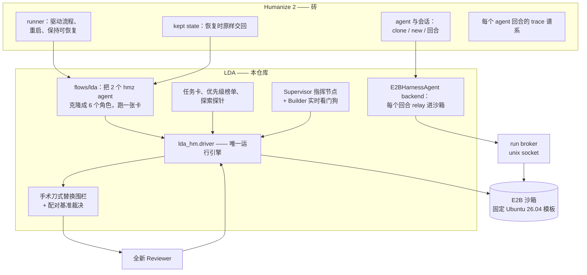
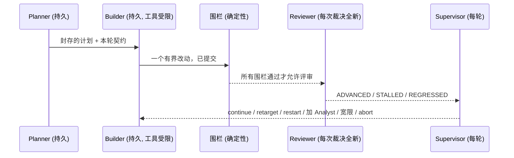
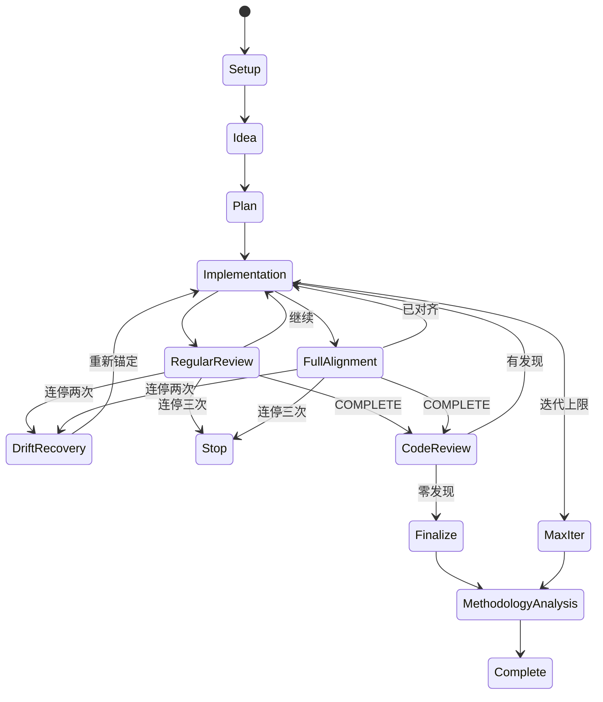

# LDA：Linux Development Agent

[English](README.en.md)

LDA 是一套用长时运行 AI agent 为 Ubuntu 26.04 软件包开发真实性能优化的工作流 ——
硬约束是：优化产物必须能在原生系统上作为 **drop-in 替换**直接安装，
已有的二进制、程序和开发流程全部原样可用。

agent harness（执行框架）是 [Humanize 2](https://github.com/humanfia/humanize2)（`hmz`）：
循环、agent 会话、重试、可恢复状态与 trace 谱系都归它的 runner 管。
本仓库是一个 Humanize *flowverse* —— 在这套框架之上贡献所有 LDA 特有的东西：
硬性兼容围栏、两层认证基准、任务卡、包优先级榜单和监督规则。
每一次构建、测试、基准和 agent 回合都在同一个固定模板创建的 E2B 沙箱里执行；
任何东西都不在裸机上跑。

- **快速开始** → [跳转](#快速开始)
- **工作流交付的是什么** → [输出](#工作流的输出)
- **什么样的优化才算合格** → [手术刀式替换边界](#手术刀式替换边界abiffi)
- **工作流如何构建在 Humanize 之上** → [跳转](#工作流如何构建在-humanize-2-之上)
- **噪声主机上怎么把基准做对** → [跳转](#多租户噪声主机上的基准测试)
- **十个包各自测什么** → [跳转](#十个包各自测什么)
- **已测得的加速** → [认证结果，在最底部](#认证结果)

---

## 工作流的输出

一张卡跑完，交付物是三样东西，全部落在 results root 的 `runs/<run-id>/` 里，
并由 `tools/archive-run.py` 归档进本仓库的 `runs/<run-id>/`：

| 交付物 | 位置 | 说明 |
|---|---|---|
| **drop-in `.deb` 包集** | `packages/*.deb` + `SHA256SUMS` | 由固定 Ubuntu 26.04 源码重构建的二进制包，`Package`/`Version`/`Architecture` 与原生完全相同，`dpkg -i` 直接覆盖安装原生包、`dpkg -i` 原生包即回滚；这就是"手术刀式替换"的实体 |
| **源码补丁** | `candidate.patch` + `candidate-log.txt` | 对固定版本 Ubuntu 源码包的 git diff；任何人在新沙箱里 `apply` 它都能重建出同一套 `.deb`（认证阶段正是这么做的） |
| **证据包** | `benchmark-summary.json`、`certification-summary.json`、`rounds/`、`raw-traces/*.jsonl.gz`、`finalize-summary.md`、`speedup-report.md` | 配对基准（训练集 + 隐藏 holdout）、新沙箱重认证、逐轮围栏与裁决、每个 agent 回合的完整 stream-json 轨迹、加速机制报告 |

没有 `.deb` 的加速不算交付；没有轨迹的 `.deb` 不算认证。

---

## 手术刀式替换边界（ABI/FFI）

这是 LDA 最硬的一道围栏，也是整个项目长成这个样子的原因。
优化后的包必须能用 `dpkg -i` 装到原生 Ubuntu 26.04 系统上，
而已有的每一个二进制、每一个程序、每一条开发流程都**不需要重编译、不需要修改**
就继续工作。用 Ubuntu 的人应该是直接安装我们的库就获得加速 ——
而不是更换发行版或重编译自己的应用。

这个承诺说起来容易、破坏起来也容易，所以它按候选逐项机械执行，
在任何评审者介入之前：

| 围栏 | 要求 |
|---|---|
| 交付库集合 | 候选 deb 交付的共享库与基线完全一致 —— 同名、不增、不减 |
| SONAME 与 ELF 身份 | class、字节序、OS/ABI、机器、类型全等；SONAME 永不改变 |
| 动态符号表 | 导出符号及其版本与原生逐项相等 |
| 类型级 ABI | 带调试信息（dbgsym）的 `abidiff` 报告零差异 |
| NEEDED 集合 | 候选链接的库与基线相同 |
| 包关系字段 | Package、Version、Architecture、Depends、Pre-Depends、Provides、Breaks、Conflicts 字节相等，`apt` 对替换品的处理与原生完全一样 |
| FFI 证明 | **针对基线编译一次**的消费者二进制，不做任何改动直接跑在候选上，输出一致 |
| 行为等价 | 每个 fixture 经基线与候选 解码/渲染/解析 的结果逐字节一致 |
| 包生命周期 | 候选能在真实系统上覆盖安装原生包，已编译消费者照常运行，且能干净回滚到原生 |
| 安全加固 | RELRO、栈不可执行、无 TEXTREL/RPATH、Build ID 保留 |
| 上游测试 | 候选重构建期间必须跑包自己的测试套件，且构建日志必须能证明这一点（打包方式明确禁用测试的记为不适用，绝不默认通过） |
| autopkgtest | 包的 `debian/tests` 对安装后的候选运行；基线上通过的每一项必须再次通过 |
| 轨迹审计 | Builder 自己的行为记录要通过防作弊审计（见[监督层](#监督层指挥层)） |

**加速永远不能抵偿围栏失败。** 这就是优化保持诚实的机制：
让数字变好的唯一途径是把代码真的变快，因为所有能造假的路都被围栏封死了。

这条边界对 agent 允许的优化方式有直接约束：

- 架构特定代码可以写，但必须通过**运行时分发**（一次性 CPUID / `target_clones`）
  到达，并保留通用路径 —— 同一个 deb 在任何 x86-64 主机上都必须正确。
- 新的快速路径必须保持符号**隐藏**；导出一个新符号就会打破符号表围栏。
- 编译选项类工作（LTO、循环展开）只允许在不改变导出 ABI 的范围内使用 ——
  而且要实测、不能假设（见结果表 cairo 一行：重新启用 LTO 实测有效但低于门槛）。

## 两层基准测试

每一个性能主张都在两层测量，因为只有库层 micro 基准并不能证明用户可见的收益：

- **Micro（微基准）** —— 直接锻炼被优化库自身代码的工作负载，
  是 Builder 的局部奖励信号。Builder 能看到的输入是*训练集*。
- **端到端（e2e）** —— 一条*穿过*该库的真实消费路径，验证 micro 收益在应用中仍然
  成立。本仓库的 e2e 工作负载都是各目标的真实消费者：libpng 用 cairo PNG-surface
  加载和 gdk-pixbuf 解码，libcairo2 用 cairo 渲染栈，GTK 用 GObject-introspection
  churn，libsoup 用 HTTP 往返，sssd 用经 NSS 的 `getent`。

认证还额外要求：在 Builder 从未见过、由宿主持有种子生成的**隐藏 holdout**
上达到声明的余量，并在**新沙箱**里整体重放。噪声策略见
[多租户噪声主机上的基准测试](#多租户噪声主机上的基准测试) —— 那是迭代次数最多的部分。

## 工作流如何构建在 Humanize 2 之上

`hmz` 是砖，LDA 是用这些砖垒起来的楼。通用 agent 机制在这里从不重造 ——
所以给流程扩展一个新包族只是一个 workbench 脚本加一个卡片 profile，
换模型或换 agent backend 是一个 flag，而不是一次重写。

**Humanize 拥有的**

- **runner**：驱动流程、重启流程、保持流程可恢复
- **agent 与会话**：`clone` / `new` / 回合执行，以及回合失败的语义
- **kept state**：按 workspace 周期保存的 `state` 字典，恢复时原样交回
- 每个 agent 回合的 **trace 谱系**（`hmz trace collect` 能看到整个 run）

**LDA 贡献的**

| 接缝 | 文件 | 作用 |
|---|---|---|
| 流程声明 | `flows/lda/__init__.py` | 一个 `@flow(resumable=True)`：接过两个 hmz agent（`builder`、`reviewer`）和 hmz 的 kept `state`，跑完一张任务卡 |
| 角色扇出 | `src/lda_hm/hmz_glue.py` | 把接到的两个 agent 克隆成 LDA 的**六个**角色，并包装成引擎的 Agent/Session 协议 |
| agent backend | `src/lda_hm/hmz_backend.py` | 一个 `AgentBase` / `CommandSessionBase`：每个回合都被 relay **进这张卡的 E2B 沙箱** |
| relay | `src/lda_hm/hmz_relay.py` | 每回合一个宿主侧进程：把 prompt 推进沙箱、跑沙箱内 agent CLI、打印回复 |
| 沙箱 broker | `src/lda_hm/broker.py` | 流程进程通过 unix socket 把自己的沙箱连接借给 relay 进程，一只沙箱服务全部角色 |
| 运行引擎 | `src/lda_hm/driver.py` | LDA 循环本体：setup、rounds、围栏、基准、finalize |

因为这个 backend 就是一个普通的 hmz agent backend，在 hmz 眼里沙箱内的 LDA 回合
和任何 agent 回合没有区别 —— 所以模型凭据留在沙箱内（relay 不携带任何凭据），
agent 扮演的角色就是它的 hmz 名字（`clone(name="builder")`），
整个 run 对 hmz 的 tracing 保持可见。`hmz_glue.py` 刻意不 import hmz：
它只通过 agent 的公开接口对话，引擎测试因此能用桩在任何 Python 上驱动同一套代码。



## 角色：持久写者、新鲜读者

hmz 交给流程的两个 agent 被克隆成六个命名角色。写者保留上下文，
因为它必须接着没写完的推理继续写；读者每次全新启动，
因为独立性本身就是评审边界的一部分。

| 侧 | 角色 | 会话 | 职责 |
|---|---|---|---|
| builder | Drafter | 持久 | 产出想法草稿 |
| builder | Planner | 持久 | 修订并封存候选计划 |
| builder | Builder | 持久 | 每轮一个有界改动，工具受限 |
| reviewer | Analyst | 每次阅读全新 | run 卡住时的独立诊断 |
| reviewer | Reviewer | 每次裁决全新 | 围栏全过之后，对证据裁决 |
| reviewer | Supervisor | 每轮 | 依据 run 自己的证据进行指挥 |



## 一张卡的一次运行

1. **Explore（开卡之前）**：`lda explore <包名>` 在新沙箱里测量原生工作负载，
   用 `perf` 归因热点，写出诚实的可行性判定 —— *包括证伪*：
   当热点代码其实在别的包里的时候。这是项目不在推不动的包上烧 run 的原因。
2. **Setup**：从固定模板起沙箱；记录在案的 APT 快照是唯一包源；
   安装集对齐到快照；抓取精确源码版本并提交为基线；
   围栏自检必须先在已知坏样本上报警，其判定才可信。
3. **Rounds**：持久 Builder 每轮做一个有界改动（回合内工具卫兵实时拦截证据篡改）；
   围栏与配对基准评判该轮；全新 Reviewer 对证据裁决；Supervisor 指挥。
4. **Finalize**：整个结果在从不可变模板新起的沙箱里重放 ——
   从快照 setup、重打补丁、重跑全部围栏、新种子 holdout ——
   之后才允许称为已认证。



## 多租户噪声主机上的基准测试

E2B 沙箱和其他租户共享宿主，所以基准策略的设计目标是让噪声**可见且不可利用**，
而不是假装它不存在。下面每一条规则的背后都是一次被噪声打脸的教训：

- 全部计时由工作负载脚本在沙箱**内部**采集，并带有被测进程看不到的
  每次调用 nonce；宿主墙钟时间从不作为裁决依据；
- 基线与候选在**同一只沙箱内**逐次交替，宿主漂移在每一对内部相消；
- 单次重复要跑**数秒**而不是几十毫秒 —— 进程启动与调度抖动必须相对效应可忽略；
- 只有当逐次重复对数比值的 **95% Student-t 区间**不含 1.0、超过声明的最小值、
  且重复不少于三次时，加速才可认证；
- 任一样本的**租户间 CPU steal 超过 10%** 判本次运行本身无效
  （重试一次，然后计为基础设施阻塞 —— 不怪候选）；
  与效应完全不成比例的离散度按同样方式处理；
- Builder 能看到的 micro 输入是训练集；认证还要求在宿主持有种子的
  **隐藏 holdout** 上达到声明余量；
- 在某台宿主上信任认证之前，先让基线对自己测一次（**A-A 空跑**）：
  能在无效应处解出效应的 harness 是假阳性发生器，其裁决一律拒收；
- **finalize 在新沙箱中重放**，新沙箱落在其他宿主上 ——
  只在一台机器上存在的加速不会通过认证。
- **固定规则扩样**：点估计过了门槛但配对 t 区间仍含 1.0 的候选，
  不是被否定而是欠采样 —— 自动再补最多两块同样次数的重复，
  在合并样本上重判（`LDA_BENCH_EXTENSION_BLOCKS`）。规则写死在代码里、
  与 Builder 无关：低于门槛的候选一次也不补，合并后的区间仍必须自己排除 1.0；
  这堵住了"7 次重复量不出真实的 2% 效应"这个假阴性来源，又不给钓鱼留门。
- **安装态 A/B**：typelib、私有库目录、数据文件按绝对路径加载的包
  （gnome-shell、gnome-settings-daemon、LibreOffice、sssd），
  每一侧在计时区外用 `dpkg -i` 装上自己那套 `.deb` 再测 ——
  被测的就是用户会装的那个东西，而不是靠 `LD_LIBRARY_PATH` 拼出来的近似。
- **归因先于计时**：每个 workbench 在计时前先证明被计时的代码确实来自
  被测那一侧的构建（加载的 `.so` 路径、安装文件的 sha256、插件文件名），
  并在开卡前用 `perf` 记录包自身代码占计时周期的份额 ——
  份额小的包（见下表）会诚实地得到"推不动"的结论，而不是一个噪声里的数字。

E2B 上的基准**是否可信**，这里的答案是：单次数字不可信，配对裁决可信。
一切裁决只看同一沙箱内交替测出的成对比值，噪声进入区间宽度而不是进入结论；
A-A 空跑证明仪器不会无中生有；隐藏 holdout 和新沙箱重放证明效应不属于某一台机器。

沙箱测量能力（逐 run 探测并记录）：Firecracker 客户机不暴露 PMU ——
`cycles` 事件不可用 —— 剖析因此使用软件采样（固定快照里的 `linux-perf`）。
目标 CPU（Intel Xeon Gold 6548Y+，Emerald Rapids）报告完整的 AVX-512/AMX
标志集；架构特定工作面向这些标志、但藏在运行时分发之后，包在任何机器上都保持正确。

## 十个包各自测什么

每个包的 micro 工作负载都由包**自己的**代码承担计时工作，每次重复跑数秒，
输出逐字节哈希，holdout 用宿主持有的种子重新生成；e2e 是穿过该包的真实消费路径。
"包内份额"是开卡前 `perf cpu-clock` 记录的基线自身周期占比 —— 它决定一个包
在这套围栏下的天花板。

| 包 | micro（Builder 的局部奖励） | e2e（真实消费路径） | 包内份额 |
|---|---|---|---|
| libgtk-4-1 / libgtk-3-0t64 | 编译式 dlopen workbench：CSS 解析、选择器匹配、整树布局（三输入） | GObject-introspection churn | 高（gtk 自有机制） |
| libcairo2 | 虚线贝塞尔描边、自交填充、语料文本路径（cairo 自有描边器/扫描转换器） | cairo 渲染栈 PNG 加载 | 高（pixman/libz 被排除） |
| libsoup-3.0-0 | HTTP 头部解析：quality list、参数列表、大小写不敏感查找 | 本地 HTTP 往返 | 高 |
| sssd-common | 安装态 proxy-files 域上的种子化 NSS 查询表 | 新进程 `getent` | 中（responder + client） |
| gstreamer1.0-plugins-good | 包内视频滤镜（videoflip/balance/gamma/median/box/crop）、effectv 特效、整数音频效果链（audiodynamic/panorama/amplify/karaoke/invert/level）；每侧独立插件目录 + 私有注册表 | WAV→FLAC 转码 + MJPEG-in-AVI 采集式编码 | 42–48% |
| libreoffice-core | 种子化 ODF 文档语料（Writer 长文档、Calc 无缓存值公式表）→ PDF，单次 soffice 批量转换 | DOCX/XLSX 导出再导入 | ~40%（libmergedlo + sal） |
| gnome-shell | 整壳 headless 启动：mutter headless 后端 + GNOME 自己的 mock-session runner 与 test-tool，自动化脚本在壳就绪后退出 | 启动后 overview 显示/隐藏三次 | ~3% C（其余是壳自带 JS 在 gjs 里执行 + 软渲染） |
| gnome-settings-daemon | 逐个插件启动到占住 `org.gnome.SettingsDaemon.*` 总线名（私有 session/system 总线 + dbusmock 的 logind/UPower/NM/polkit/gnome-session） | 全部插件并行启动（gnome-session 的方式） | 低（启动路径） |
| ibus | 注册表：种子化组件语料（~280 组件、~11k 引擎描述）写缓存 + 读回 | 守护进程按键会话：12k 次按键经 simple 引擎（含 compose 序列）往返 | ~1–2%（GLib/IPC 为主） |

份额栏是诚实的天花板声明：gnome-shell 与 ibus 这类包，重编译自身 C 代码几乎推不动计时路径，
能拿到的加速只可能来自它们自己的启动逻辑（JS/配置/序列化），围栏照样判。

## 监督层（指挥层）

权限次序固定：**人类控制文件 > 确定性规则 > LLM 参谋。**

- **实时看门狗**在回合进行中读取 Builder 不断增长的 trace，并镜像到宿主
  （agent 无法改写自己的历史）；对停滞的 agent 进程二次确认后击杀 ——
  观察不到就绝不击杀。每个回合还在沙箱内独立受墙钟约束
  （`LDA_TURN_TIMEOUT`，默认 4200 秒），失控的 agent 进程活不过它的 relay。
- 每轮之间，**Supervisor** 用 run 自己的证据组装脉搏
  （裁决、阻塞、基准趋势、trace 统计、沙箱负载、花费），
  给出一条可审计的决定：continue、retarget、重启 Builder、召独立 Analyst、
  给改善中的差一点一次每 run 一回的宽限、或 abort。只有 run 偏航时才咨询
  LLM 监督者；格式不合的回答降级为规则决定，且 **LLM 的 abort 会被降级为
  retarget** —— 只有人类和硬规则可以终结一个 run。
- `<run>/control.json` 是**人类通道**，每个阶段边界都会重读：
  `{"action": "abort"}`、`{"contract": "..."}`、`{"action": "restart_builder"}`。
- **基础设施故障永远不算在候选头上。** 被模型网关故障杀死的 Builder 回合、
  内容是传输错误的 Reviewer 回答、不稳定的基准窗口 ——
  每一个都记为基础设施阻塞，不消耗停滞预算也不消耗迭代预算。
  连续三次会**暂停** run（状态保存、沙箱释放、退出码 75）而不是终结它，
  驱动循环在平台恢复后续跑 —— 一场持续一下午的故障不能弄丢一张卡。
- Builder 轨迹审计评判 agent **做过什么** —— 执行过的命令、编辑过的路径 ——
  从不评判它说过什么：正常行文恰恰会引用作弊命令才含有的那些模式。
  轨迹审计不过的会话会被替换成全新会话（trace 清零，停滞计数保留）。

## 包优先级：先优化什么

把 Ubuntu 几万个包全优化一遍不叫计划，所以候选从 Ubuntu 26.04 桌面 ISO
自己的依赖图里排出（`data/candidates-ubuntu-2604.json`，用 `lda candidates` 查看）。

ISO manifest 含 1,814 个 Debian 包，其中 1,811 个与 Packages 索引精确匹配；
依赖图共 12,369 条边，其中必需边（`Depends` + `Pre-Depends`）8,401 条。
候选先过滤：被至少 5 个包必需依赖、自身至少有 3 个必需依赖目标、
不属于 `oldlibs`、也不是 `required` 级核心库 —— 所以 `libc6`、`libgcc-s1`、
`libstdc++6` 特意不入榜。分数由必需扇入（复用度，权重 0.40）、必需出度
（层级，0.35）、依赖面（0.25）对数归一化组合，再乘优先级因子。
**分数只是排序代理 —— 不代表代码质量或已知缺陷。**

榜单分成两个方向：被大量上层组件复用的中间层 UI/媒体基础设施
（GTK、cairo、GStreamer、pango、gdk-pixbuf、libtiff、libpulse），
以及直接依赖面很宽的高层桌面/系统组件
（gnome-shell、LibreOffice、sssd、ibus、polkitd、cups-filters）。
逐包的当前判定见最底部的 [Top-10 状态表](#top-10-状态)。

## 快速开始

前置要求：Python **≥ 3.12**（hmz 的硬要求）、可用的 E2B 集群、
以及 Claude 兼容模型网关的凭据。

```bash
git clone -b LDA-HM https://github.com/yisun219/Linux-Development-Agent-Flow.git lda
cd lda

# 1. 一次性环境：hmz 框架、E2B SDK 和本仓库
python3.12 -m venv ~/.venvs/ldahm
~/.venvs/ldahm/bin/pip install "git+https://github.com/humanfia/humanize2.git" e2b
~/.venvs/ldahm/bin/pip install -e .          # 提供 `lda` 命令
export PATH="$HOME/.venvs/ldahm/bin:$PATH"

# 2. 自检：100 个引擎测试，不需要沙箱、不需要模型调用
python -m unittest discover -s tests         # 预期：OK（117 个测试）
bin/lda-hmz check                            # 预期：drives: ('builder', 'reviewer')

# 3. E2B 访问凭据，放在仓库之外（创建沙箱时自动加载）
install -d -m 700 ~/.config/lda-hm
cat > ~/.config/lda-hm/e2b.env <<'EOF'
E2B_API_URL=https://your-e2b-endpoint
E2B_SANDBOX_URL=https://your-e2b-endpoint
E2B_API_KEY=your-e2b-key
EOF
chmod 600 ~/.config/lda-hm/e2b.env

# 4. 构建固定的 lda-base 模板（一次性；Ubuntu 26.04 + 工具链 +
#    agent harness + 每只沙箱都会带上的技能集）
python sandbox/build_template.py

# 5. 沙箱内 agent CLI 的模型凭据。只在沙箱启动时注入；
#    宿主侧 relay 进程从不携带。
export ANTHROPIC_BASE_URL=https://your-model-gateway
export ANTHROPIC_AUTH_TOKEN=your-token
```

然后运行工作流：

```bash
# 值得优化什么：从 ISO 依赖图排出的榜单
lda candidates

# 在花一个 run 之前先测量候选（无 agent 回合，纯测量）
lda explore libsoup-3.0-0 --results-root ~/lda-runs

# 开卡，并在 hmz 框架下跑完整流程
lda gen-card libsoup-3.0-0 --out examples/libsoup3-card.json
lda init-card ~/lda-work-soup examples/libsoup3-card.json
LDA_RESULTS_ROOT=~/lda-runs bin/lda-hmz-drive ~/lda-work-soup soup-production-001
```

在 Slurm 集群上，`tools/slurm/run-card.sbatch` 是同一件事的作业封装
（宿主侧只做编排，2 核 6G；`LDA_AGENT_BACKEND=claude|codex` 选 agent 后端，
`LDA_TASK_FILE` 给这张卡的任务提示）：

```bash
sbatch --export=ALL,PKG=libcairo2,WORKSPACE=~/lda-work-cairo,RUN_ID=cairo-001 \
       tools/slurm/run-card.sbatch
tools/archive-run.py ~/lda-runs/runs/cairo-001     # 跑完：证据 + 轨迹归档进仓库 runs/
```

`bin/lda-hmz-drive` 是生产入口：它让一个 run 跨瞬时故障持续存活。
**打断一个 run 不会丢任何东西** —— 重新执行同一条命令就从 hmz 保存的状态恢复，
基础设施故障会把 run 停靠而不是终结。

常用旋钮：

| 旋钮 | 作用 |
|---|---|
| `<run>/control.json` | 操控进行中的 run（`abort`、`restart_builder`、新 `contract`） |
| `LDA_RESULTS_ROOT` | 持久证据仓库，与流程源码分离 |
| `LDA_BUDGET_USD` | 单 run 花费上限 |
| `LDA_CERT_REPLICATIONS` | 新沙箱认证重放次数（默认 2） |
| `LDA_TURN_TIMEOUT` | 单个 agent 回合的墙钟上限（默认 4200 秒） |
| `LDA_AGENT_MODEL` | 两侧模型（默认 `claude-opus-4-8`）；`LDA_AGENT_MODEL_REVIEWER` 覆盖读者侧 |
| `LDA_AGENT_BACKEND` | 沙箱内 agent CLI：`claude`（默认）或 `codex`；可按角色 `LDA_AGENT_BACKEND_REVIEWER` 覆盖 |
| `LDA_BENCH_EXTENSION_BLOCKS` | 欠采样候选最多补几块重复（默认 2） |
| `lda trace <run-dir>` | 渲染一个 run 的行为时间线 |
| `tools/e2b/reap-sandboxes.py` | 回收被 SIGKILL 的驱动进程没能释放的沙箱 |

## 仓库结构

```text
flows/lda/           hmz runner 执行的流程声明
src/lda_hm/
  driver.py          两个入口共用的唯一运行引擎
  hmz_glue.py        hmz agent -> LDA 角色与引擎协议
  hmz_backend.py     hmz agent backend：回合 relay 进沙箱
  hmz_relay.py       每个 agent 回合一个 relay 进程
  hmz_launcher.py    `bin/lda-hmz`：构建 agent，调用 hmz 的 Runner
  broker.py          流程进程外借自己的沙箱连接
  execution.py       E2B 生命周期、完整性钉扎、认证
  fence.py gates.py  评审者之前的确定性边界
  benchmark.py       配对统计、nonce 采样、Student-t 策略
  supervision.py     Supervisor 规则、run 脉搏、Builder 看门狗
  explore.py         排名包的开卡前可行性探针
  cardgen.py         已剖析候选的任务卡生成器
  candidates.py priority.py   榜单与打分
sandbox/lda-base/    模板配方：Dockerfile、检查、harness、技能
examples/            已生成的任务卡（top-10 全部 + libpng）
runs/                归档的 run：证据、候选补丁、.deb 校验和、agent 轨迹（gzip）
tools/               archive-run.py、slurm/run-card.sbatch、e2b/reap-sandboxes.py
data/                ISO 依赖图排出的 top-30 候选
tests/               117 个引擎与卡片测试（无模型调用、无沙箱）
docs/FLOW.md         流程机制详述
docs/BASELINE.md     基线采集与快照对齐
```

发进每只沙箱的技能（`sandbox/lda-base/skills/`）采用 `<名字>/SKILL.md` 布局，
bootstrap 时链接进 agent 的技能路径，所以 Builder 真的会加载它们：
LDA 的围栏、micro 基准、端到端基准与对抗评审契约，实测出的 libpng 经验
（含已验证补丁），以及固定版本的 Intel performance skills。

## 开发

```bash
python -m unittest discover -s tests -v   # 117 个测试，不需要模型或沙箱
bin/lda-hmz check                         # 校验流程声明
```

---

# 认证结果

下面每个数字都来自沙箱内配对基准，在 Builder 从未见过的隐藏 holdout 上成立，
并在新沙箱中重新认证，同时完整的 ABI/FFI 手术刀式替换围栏全绿。
证据保存在 results root 下的各 run 目录里。

## libpng16-16t64 —— 已认证

**Run `libpng-2604-production-008`，COMPLETE（2026-08-28）。**

| 层 | 结果 |
|---|---|
| Micro（训练集） | 解码 **+6.77%** |
| Micro（隐藏 holdout） | **+6.76%**（比值 95% CI 0.9323–0.9419，7 次重复，最大 steal 0.16%） |
| 端到端 | cairo PNG-to-surface 栈 **+12.40%** |
| 新沙箱重认证 | 2 只新沙箱 +6.68% / +6.95% micro，+12.44% / +11.48% e2e（新种子 holdout） |
| 围栏 | 10/10 全绿；独立代码评审 0 发现 |
| Drop-in 检验 | deb 在真实系统上覆盖安装原生 `libpng16-16t64` 1.6.57-1，并能干净回滚 |

**怎么加速的。** SSE4.1 Paeth 反滤波：把 SSE2 的多指令 abs/select 模拟换成
`pabsw` + `pblendvb`，另加一条 SSE2 Up 滤波行（`-O2` 永远不会自动向量化那个
字节循环）。通过一次性 CPUID 分发到达，符号隐藏，保留 SSE2 回退。

**为什么更快。** 同一条逐行滤波递推在目标 Xeon 上以更少的 uop 退休。
构造上逐字节精确：混合掩码来自 `cmpeq`，做出的选择与标量代码完全一致。

**为什么仍是 drop-in。** 分发是内部的、新代码是隐藏符号，
SONAME、动态符号表和 `abidiff` 全部不动 ——
这正是它能直接装进现有 Ubuntu 系统的原因。

**一条值得记录的发现：** Ubuntu 26.04 的 gdk-pixbuf 2.44 经 `glycin`（Rust）
解码 PNG，所以 libpng 的工作**推不动** pixbuf 路径（6 次测量 0% ± 0.7%）。
`cairo_image_surface_create_from_png` 才是桌面上真实的 libpng 消费路径，
+12.4% 就落在那里。当初若去追 pixbuf 路径，会得到一个用户完全无感的真 micro 收益。

## 已测得、尚未认证

**libsoup-3.0-0**：头部层 micro +8.0% 训练 / +7.4% 隐藏 holdout ——
正序建表省掉 `g_slist_reverse` 遍历，quality-list 解析去掉中间的
GSList+strdup 翻腾；分配次数不变，输出逐字节一致。该 run 在认证开始之前
死于一次轨迹审计误报（当时审计在扫描行文；已修复 ——
现在只读执行过的动作）。重跑已排队。

## Top-10 状态

Campaign `claude-0902-top10`（2026-09-02 起）：十张卡全部在 Slurm 上经同一条工作流运行，
agent 后端 Claude（claude-opus-4-8），每张卡一只 E2B 沙箱；逐 run 证据见 `runs/`。
下表随收割更新；在认证结果落地之前，状态栏就是状态，不预告数字。

| # | 包 | 分数 | run | 状态 | 机制 / 判定 |
|---|---|---|---|---|---|
| 1 | libgtk-4-1 | 71.50 | `gtk4-c0902-001` | 运行中 | 已知起点：仅编译选项（-O3 -mtune）实测 +1.73%，低于 2% 门槛，需叠加 CSS 解析/匹配的源码级机制 |
| 2 | libgtk-3-0t64 | 69.42 | `gtk3-c0902-001` | 运行中 | 早前未认证 run 实测 +3.55% micro / +1.72% e2e |
| 3 | gnome-shell | 64.28 | `gnome-shell-c0902-001` | 运行中 | 整壳 headless 启动；包内 C 份额 ~3%，天花板在壳自身 JS 启动逻辑 |
| 4 | libreoffice-core | 63.34 | `libreoffice-c0902-001` | 运行中 | 整包构建以小时计（构建树 ~56G），一轮一天量级 |
| 5 | sssd-common | 60.69 | `sssd-c0902-001` | 运行中 | 客户端 mmap 解码路线实测 −0.2%（已排除）；剖析先行 |
| 6 | libcairo2 | 60.20 | `cairo-c0902-001` | 运行中 | 重开 LTO 实测 +1.38%，需第二种叠加机制 |
| 7 | gnome-settings-daemon | 59.67 | `gsd-c0902-001` | 运行中 | 插件启动到占名；启动路径包内份额低 |
| 8 | gstreamer1.0-plugins-good | 59.55 | `gst-good-c0902-001` | 运行中 | 包内滤镜/特效/音频效果为计时主体（42–48%） |
| 9 | ibus | 57.77 | `ibus-c0902-001` | 运行中 | 注册表 + 按键会话；包内份额 ~1–2% |
| 10 | libsoup-3.0-0 | 54.01 | `soup-c0902-001` | 运行中 | 机制已证明（头部解析 +8.0% / holdout +7.4%），本次重跑认证 |

「证伪」是有意义的产出：探索证明了重编译*那个*包推不动实测热点 ——
因为热点代码在别处。记下它只花一次探针、省下一整个 run ——
也正因如此，上面的认证数字才值得按面值相信。
