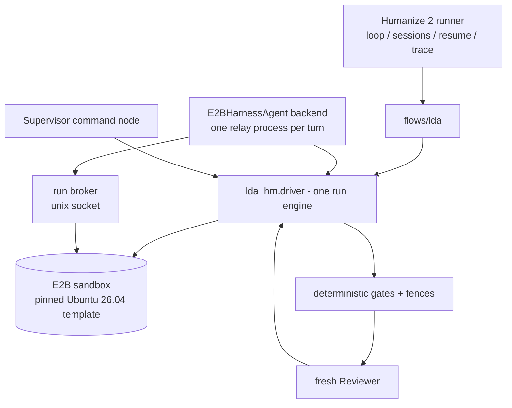
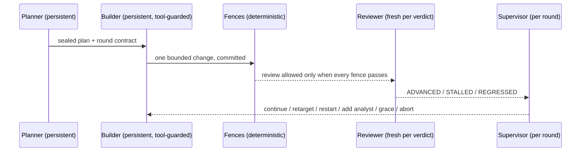

# LDA: Linux Development Agent

LDA lets long-running AI agents develop performance optimizations for Ubuntu
26.04 packages that install as drop-in replacements for the official ones.
The flow harness is Humanize 2 (`hmz`): its runner owns the loop, the agent
sessions, retries, resumable state, and run traces. This repository is a
flowverse that contributes everything LDA-specific on top of that harness -
the hard compatibility fences, the two-layer certified benchmarks, the task
cards, the package priority list, and the supervision rules. Every build,
test, benchmark, and agent turn executes inside E2B sandboxes created from
one pinned template; nothing runs on a bare host.

## Certified results

Every number below is from paired in-sandbox benchmarks, held on a hidden
holdout the Builder never saw, re-certified in fresh sandboxes, with the full
ABI/FFI surgical-replacement fence suite green. Evidence lives in the run
directories under the results root.

| package | run | micro (train) | hidden holdout | end-to-end | status |
|---|---|---|---|---|---|
| libpng16-16t64 | libpng-2604-production-008 | +6.77% decode | +6.76% | +12.4% cairo PNG-to-surface stack | certified, replicated in 2 fresh sandboxes |
| libcairo2 | libcairo2-2604-production-003 | - | - | - | RUNNING |
| libsoup-3.0-0 | libsoup3-2604-production-001 | - | - | - | RUNNING |

## The surgical-replacement boundary (the hardest fence)

An optimized package must be installable on a stock Ubuntu 26.04 system with
`dpkg -i`, and every existing binary, program, and development workflow must
keep working unmodified. That boundary is enforced mechanically, per
candidate, before any reviewer is consulted:

- **Shipped library set**: the candidate debs ship exactly the baseline's
  shared libraries - same names, no additions, no removals.
- **SONAME and ELF identity**: class, endianness, OS/ABI, machine, and type
  are equal; SONAME never changes.
- **Dynamic symbol table**: exported symbols and their versions are equal to
  stock, entry for entry.
- **Type-level ABI**: `abidiff` with debug info (dbgsym) reports no
  difference.
- **NEEDED set**: the candidate depends on the same libraries the baseline
  did.
- **Package relationship fields**: Package, Version, Architecture, Depends,
  Pre-Depends, Provides, Breaks, Conflicts are byte-equal, so apt treats the
  replacement exactly as it treats stock.
- **FFI proof**: a consumer binary compiled once against the baseline runs
  unmodified against the candidate with identical output.
- **Behavior**: every fixture decodes/renders/parses to byte-identical
  results through baseline and candidate.
- **Package lifecycle**: the candidate installs over stock on a live system,
  a compiled consumer still runs, and stock rolls back cleanly.
- **Security hardening**: RELRO, non-executable stack, no TEXTREL/RPATH, and
  Build IDs survive.
- **Upstream tests**: the package's own test suite runs during the candidate
  rebuild and the build log must prove it (a packaging that visibly disables
  its tests is recorded as not-applicable, never assumed to have passed).
- **autopkgtest**: the package's `debian/tests` run against the installed
  candidate; every test that passed on baseline must pass again.

A speedup never compensates for a fence failure.

## Flow architecture



Roles and independence (persistent writer, fresh reader):



One run of a card:

1. **Explore** (before any card): `lda explore <package>` measures a stock
   workload in a fresh sandbox, attributes cycles with perf, and writes an
   honest feasibility verdict - including falsification when the hot code
   lives in another package.
2. **Setup**: sandbox from the pinned template; the recorded APT snapshot is
   the only package source; the installed set is aligned to the snapshot;
   the exact source version is fetched and committed as the baseline; the
   fence self-checks must flag known-bad samples before any verdict is
   trusted.
3. **RLCR rounds**: a persistent Builder makes one bounded change per round
   (an in-turn tool guard blocks evidence tampering as it happens); fences
   and paired benchmarks judge the round; a fresh Reviewer rules on the
   evidence; the Supervisor steers.
4. **Finalize**: the whole result replays in fresh sandboxes from the
   immutable template - setup from the snapshot, patch re-applied, all
   fences re-run, fresh-seed holdout - before anything is called certified.

## Benchmarks on a noisy multi-tenant host

E2B sandboxes share hosts with other tenants, so the benchmark policy is
designed to make noise visible and non-exploitable rather than to pretend it
away:

- all timing is taken inside the sandbox by the workload script and tagged
  with a per-invocation nonce the measured process cannot see; host wall
  time is never judged;
- baseline and candidate alternate within one sandbox, per repetition, so
  host drift cancels inside each pair;
- a speedup certifies only when the 95% Student-t interval on per-repetition
  log ratios excludes 1.0, the declared minimum is cleared, and fewer than
  three repetitions never certify;
- co-tenant CPU steal above 10% of any sample invalidates the run itself
  (one retry, then an infrastructure block - the candidate is not blamed);
  a spread wildly out of proportion to the effect is treated the same way;
- the micro inputs the Builder can see are the train set; certification also
  requires the declared margin on a hidden holdout generated from a
  host-held seed;
- finalize replays everything in fresh sandboxes that land on other hosts,
  so a speedup that only existed on one machine does not certify.

Measurement capability of the sandboxes (probed, recorded per run): the
Firecracker guests expose no PMU - `cycles` is unsupported - so profiling
uses software sampling (`linux-perf` from the pinned snapshot); the target
CPU reports the full AVX-512/AMX flag set, and architecture-specific work
targets those flags with runtime dispatch (`target_clones`) so the package
stays correct on any x86-64 host.

## Supervision (the command layer)

Authority is fixed: human control file > deterministic rules > LLM counsel.

- A live watchdog reads the Builder's growing trace during a turn, mirrors
  it to the host (so an agent cannot rewrite its own history), and kills a
  stalled agent process after double confirmation - a watchdog that cannot
  observe never kills.
- Between rounds the Supervisor assembles a pulse from the run's own
  evidence (verdicts, blocks, benchmark trend, trace statistics, sandbox
  load, spend) and emits one auditable decision: continue, retarget,
  restart the Builder, add an independent Analyst, grant a one-per-run
  grace for an improving near-miss, or abort.
- `<run>/control.json` is the human channel, re-read at every phase
  boundary: `{"action": "abort"}`, `{"contract": "..."}`,
  `{"action": "restart_builder"}`.
- Infrastructure failures (unstable host, dead backend) never count against
  the candidate; they have their own circuit breaker.

## Top-10 exploration (Ubuntu 26.04 desktop dependency graph)

The priority list is computed from the ISO's dependency graph (fan-in,
required out-degree, dependency surface, priority factor) - see
`data/candidates-ubuntu-2604.json`. Every top-10 candidate was explored
with measurements before any optimization was attempted; full evidence per
package sits in `explore/<package>/` under the results root.

| # | package | score | verdict | how it was measured / why it can (or cannot) be accelerated |
|---|---|---|---|---|
| 1 | libgtk-4-1 | 71.50 | measurable, needs a compiled workbench | 40x300 widget churn under Xvfb: only ~11% of cycles land in libgtk-4 itself under a gi driver; a card needs a compiled consumer to concentrate the reward on gtk's layout/CSS code |
| 2 | libgtk-3-0t64 | 69.42 | measurable, needs a compiled workbench | same shape; ~15% of cycles in libgtk-3, pango 9% |
| 3 | gnome-shell | 64.28 | falsified honestly | the frame loop lives in libmutter/clutter and JS in gjs; recompiling gnome-shell itself cannot move those hot paths |
| 4 | libreoffice-core | 63.34 | deferred: not operable per-round | headless convert-to-pdf is a ready e2e workload, but one candidate rebuild costs hours in-sandbox |
| 5 | sssd-common | 60.69 | deferred: needs LDAP fixture harness | hot paths are NSS/PAM lookups against a directory service the template does not ship |
| 6 | libcairo2 | 60.20 | CARDED - run in progress | png-load turns out to be 81.6% libz / 9.5% libpng / 4.3% cairo (which is exactly why the libpng card moved cairo e2e +12.4%); the card's reward concentrates on paint/mask/text-path, cairo's own compositing and path code |
| 7 | gnome-settings-daemon | 59.67 | deferred: needs a session harness | most gsd plugins need a live session bus; only a startup subset is measurable headlessly |
| 8 | gstreamer1.0-plugins-good | 59.55 | falsified for decode: 90% libvpx | perf shows 90.3% of decode cycles in the external codec; the package's own demux/parse share is under 3% |
| 9 | ibus | 57.77 | deferred: needs an input fixture | a truthful key-roundtrip benchmark needs a focused window and synthetic input events |
| 10 | libsoup-3.0-0 | 54.01 | CARDED - ready to run | 600 loopback HTTP roundtrips take 26.5s, reproducible across sandboxes to 0.1%; header parsing (quality lists, params, case-insensitive lookups) is string-heavy code compiled at -O2, entirely inside this package |

## Quick start

```bash
# one-time: the hmz virtualenv (Python >= 3.12) and this repository
uv venv --python 3.12 ~/.venvs/ldahm
uv pip install --python ~/.venvs/ldahm/bin/python <humanize2> e2b
uv pip install --python ~/.venvs/ldahm/bin/python -e .

# E2B access (never in the repository): ~/.config/lda-hm/e2b.env
export E2B_API_URL=... E2B_SANDBOX_URL=... E2B_API_KEY=...
python sandbox/build_template.py     # build the lda-base template once

# explore a ranked candidate (no agent turns, measurements only)
lda explore libsoup-3.0-0 --results-root ~/lda-runs

# open a card and run the full flow under the hmz harness
lda gen-card libsoup-3.0-0 --out examples/libsoup3-card.json
lda init-card ./work-soup examples/libsoup3-card.json
bin/lda-hmz-drive ./work-soup soup-production-001
```

Agent credentials are injected only when a sandbox starts; the relay
processes carry none. `LDA_BUDGET_USD` caps spend,
`LDA_CERT_REPLICATIONS` sets fresh-sandbox certification replications, and
`lda trace <run-dir>` renders a run's behavioral timeline.

## Repository layout

```text
flows/lda/           the flow the hmz runner executes
src/lda_hm/
  driver.py          one run engine shared by both entry points
  hmz_backend.py     hmz agent backend: turns relayed into the sandbox
  hmz_relay.py       one relay process per agent turn
  broker.py          the flow process lends its sandbox connection
  execution.py       E2B lifecycle, integrity pinning, certification
  fence.py gates.py  deterministic boundary before any reviewer
  benchmark.py       paired statistics, nonce samples, Student-t policy
  supervision.py     Supervisor rules, run pulse, Builder watchdog
  explore.py         pre-card feasibility probes for ranked packages
  cardgen.py         task-card generator for profiled candidates
sandbox/lda-base/    template recipe: Dockerfile, checks, harness, skills
examples/            generated task cards (libpng pilot, cairo, soup)
data/                ranked top-30 candidates from the ISO dependency graph
tests/               engine and card tests (no model calls)
```

## Development

```bash
python -m unittest discover -s tests -v
```
