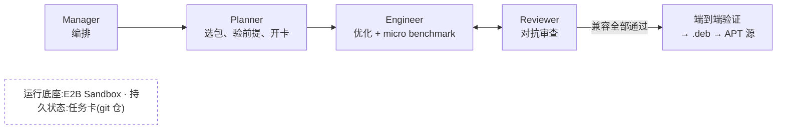

# Linux Development Agent

让 agent 长期、自主地为 **Ubuntu 26.04** 做性能优化,产出**装上即提速**的 .deb 软件包,
每一个结论都经过另一个 agent 的对抗审查。

它是一套完整的 autoresearch 流程:agent 在带检查点的任务卡上自己做计划、跑实验、写证据,
由独立会话审查;**做没做完,只看兼容性是否全部过关,不看提速多少**。
克隆本仓、接上你自己的 agent CLI,就能跑。

> 本页是概览,完整规范见 [`FLOW.md`](FLOW.md) · [English](README.en.md)

---

## 它解决什么问题

让 agent 做性能优化并不难,难的是**让它的结论可信**。一个自主运行的 agent 会很自然地
把"没测出差别"写成"证明了没问题",会在看到数据之后再挑判据,会用一次幸运的测量宣布胜利,
也会为了更快的数字悄悄改掉一个边界行为。把这样的产物装进别人的系统,是不负责任的。

LDA 的回答是:把"可信"做成流程的结构,而不是对 agent 的期望。收敛条件是兼容性而不是速度;
判据在看到数据之前就冻结;每一份证据都能被另一个 agent 独立重算和回查;防作弊检查在启用前
必须先被故意做坏的样本打红;测不出收益是正式结论,归档不交付。在这套结构下,agent 可以
放心地长期自主运行,人只需要改规则、定优先级、放行发布。

## 六个设计要点

**1. ABI/FFI 兼容是最硬的边界,也是收敛条件。**
优化 libpng、libaio、zlib 这类真实开源库,优化版必须能**直接替换 Ubuntu 官方版本**:
已有的二进制、应用程序、开发代码一律不需要修改(手术刀式替换)——正在用 Ubuntu 的人直接安装即可受益,
远比要求换系统现实。"何时算完成"只看八项兼容检查是否全部通过:二进制 ABI、外部调用面(FFI)、
行为、配置、硬件覆盖、系统升级、安全默认值、结果等价;任何一项被真实破坏都是一票否决,
不存在"更快但兼容略有妥协"的交付。(FLOW §3)

**2. 两层 benchmark。**
**Micro**:对每个被优化的库或函数生成不同输入做微基准,作为 agent 的即时反馈(局部 reward);
**端到端**:用 Chrome 页面渲染、桌面 GUI、Web server 等真实应用验证多个库的优化是否真的折射成系统级提速。
两层各自记账,永不并排比较——micro 的 +10% 不等于用户能感觉到,端到端的零也不否定 micro 的真实。
部件卡只对 micro 与兼容负责,端到端是记录义务;多个部件合起来的系统级账目由专门的集成卡裁。(FLOW §4)

**3. 对抗验证。**
一个 agent 做优化,另一个 agent 做检查,两者必须是不同会话,确保性能提升绝不以改变功能为代价。
检查者的职责是攻击而不是复述:从原始数据独立重算每一个统计量;逐个核对作业号与文件指纹;
自己伪造坏样本(假通过、证据掉包、篡改原始数据)去打防作弊检查,挡不住就是流程缺陷;
用 git 历史核对判据有没有在看到数据后被放松。裁决只有三档:确认通过 / 证据不足打回 /
发现造假整卡清零。(FLOW §5)

**4. 选包按优先级,不做全量。**
Ubuntu 有几十万个 package,绝不一开始就全量优化。先按**使用频率、性能关键程度、在依赖图中的重要性**
三个维度筛出一小批——工作量小、且能看到通用的系统级提速,不死磕单一 workload。
选点本身也是一张在循环里跑的卡:它产出候选清单和每个候选的前提探针;前提不成立就放弃这个点,
不浪费一轮优化。(FLOW §6)

**5. 人改 flow,flow 干活。**
人的工作对象是流程本身——修订规则、边界与检查;具体的优化、测试、验证全部由 agent 完成。
出了问题第一反应不是人上手修,而是补上缺失的规则,让同类问题永远过不来。
规则一落仓,正在运行的 agent 下一轮读到即自动采纳,不需要重启任何东西。(FLOW §7)

**6. 全流程放进 E2B Sandbox。**
所有 build、测试、环境恢复、fork、agent 会话都通过 Sandbox API 完成,尽量不依赖裸机。
选 E2B 而非 Docker:更适合大规模并发与秒级环境重建,更容易扩展到大量 agent 会话。
公共依赖预装一次做成快照,沙箱从快照秒级克隆,脏了就丢,永远不修。只有沙箱做不到的负载
(需要 KVM 的虚机、整机 GUI、文件同步类计时)允许在受控真机上做,且证据里必须写明理由。(FLOW §8)

## 任务卡:工作的基本单位

一项优化任务就是一张**任务卡**,一张卡只动一个部件(比如只动 zlib 这一族包),
一张卡同一时刻只有一条工作线。卡是一个独立的 git 仓,结构固定:

```
tasks/my-card/
├── .auto/
│   ├── prompt.md        任务书:目标、已知前提、每个检查点的定义、铁律
│   ├── state/GATES.tsv  检查点表:每个检查点的状态、证据路径、一句话说明
│   ├── rules.json       判据:阈值、方向、重复次数——在产生任何数据之前冻结
│   ├── checks.sh        防作弊检查:证据指纹、门号映射、引用路径存在性
│   ├── measure.sh       进度指标:通过了几个检查点、还剩几个
│   └── config.json      轮数上限等配置
├── evidence/            证据与原始数据(被引用的原始数据不许删)
│   └── HASHES.tsv       每个证据文件的 sha256
├── work/                临时区(收尾时清空)
└── NOTES.md             进展、阻塞、下一轮要做什么
```

检查点(gate)是卡的进度刻度。一张优化卡典型的检查点序列是:前提复核 → micro 测量 →
ABI 比对 → 行为等价 → 交付检查 → 端到端记录 → 收尾。每个检查点有四种终态:
通过、失败、无法判断、不适用——"不适用"必须写一句理由,空白和"不适用"是两回事。
卡的收敛条件是全部检查点到终态,且八项兼容检查没有一项失败。

## 一轮循环里发生什么

`./lda run` 驱动一张卡反复迭代。每一轮:

1. 驱动器把任务书、当前检查点表和最近的提交拼成提示词,交给引擎(一个 agent CLI 会话);
2. Engineer 读仓库根的 `FLOW.md` 与卡内任务书,挑少数几个未通过的检查点推进——写脚本、
   在沙箱里跑实验、把结果写成证据;
3. 产出数字的脚本必须**先提交再运行**:判据在看到数据之前就进了 git 历史,事后放松会被审查者查出来;
4. 每一步 git 提交;临时文件只放 `work/`,被证据引用的原始数据放 `evidence/` 并登记指纹;
5. 收尾时把检查点表更新到与证据一致,无法闭合的检查点把进展与阻塞写进 `NOTES.md`;
6. 驱动器跑 `measure.sh` 记录进度,全部检查点到终态则停止,否则进入下一轮。

循环可中断、可恢复、跨会话:引擎额度用尽时自动待命,恢复后从同一个检查点继续;
驱动器带卡级互斥锁,同一张卡不会被两条线同时推。

## 证据与测量纪律

每一份证据都写成五个要素:执行的命令、原始输出的关键行、作业编号或产物路径、
为什么它支撑结论、作业的最终状态与退出码。没有调度作业就显式写明,逐步记退出码。
证据文件登记 sha256 指纹,防作弊检查认指纹不认口号——换掉一个文件、改一个数字,指纹就对不上。

防作弊检查自己也要被检查:每条检查启用前,先拿一个故意做坏的样本(假通过、证据掉包、
篡改原始数据、引用不存在的作业号)证明它能报错;抓不住坏样本的检查不算数。

测量有自己的铁律,每一条都来自一次真实翻车:

- A 与 B 必须在同一实例内交替配对(不交替会凭空造出约 5% 的"先跑者更慢");
- 测完 A、B 再回测 A,效应必须数倍于漂移;
- 两臂必须用同一套仪器,不许在对照臂上临时加减参数;
- 单次负载不到 10 秒不配声称 1% 量级的结论;
- 文件同步类等待(fsync)在沙箱的分层文件系统上近乎免费,这类测量禁止在沙箱里定量;
- 零结果先怀疑仪器:往对照臂注入已知的慢必须能被检出,空对照必须无差;
- 数字必须带机器标识与日期,不同机器的数字不并排。

## 审查与交付

全部检查点到终态后,`./lda review` 在一个**新的、独立的**会话里发起对抗审查。
审查者不复述,只攻击:从原始数据重算每个统计量与卡面逐格对照;逐个核真作业号与文件指纹;
自己伪造至少三个坏样本去打卡内的防作弊检查;用 git 历史核对判据有没有被事后放松;
逐条核八项兼容检查。判决写进卡内 `review/VERDICT.md`,意见追加到任务书的"审查反馈"区
(只增不删),审查者绝不修改证据与检查点表。

裁决三档:**确认通过** / **证据不足打回**(逐条列缺口,Engineer 返工后再审)/
**发现造假整卡清零**。审查者每攻破一次防作弊检查,都沉淀为规范里的一条新规则,
正在运行的 agent 下一轮自动采纳。

通过审查的改动按**成因**决定交付形态:

| 成因 | 例子 | 交付形态 |
|---|---|---|
| 历史遗留的保守值 | 为 1990 年代文件系统留的等待、为早已淘汰的硬件留的保守参数 | 可进默认安装 |
| 取舍 | 用更多内存换速度、关掉某个极少触发的保护 | 仅限用户选装(opt-in),代价写进包说明 |
| 依赖硬件 | 只在某类 CPU 指令集上有收益 | 按档分发,或运行时自选 |

"未测出收益"是正式结论:记零结果归档,不交付,与正结果同权入账,后来的卡不再走同一条弯路。
优化包的版本号规则保证它永远不会压住官方的安全更新:官方一发安全版本,系统升级照常覆盖。

## 运行模型:四个角色



| 角色 | 做什么 |
|---|---|
| **Manager** | 解释操作者意图,编排工作流,阶段转换 |
| **Planner** | 按三维优先级选包,验证前提,开卡并定义证据要求 |
| **Engineer** | 在卡上实施优化,跑两层 benchmark,写证据 |
| **Reviewer** | 独立会话对抗审查:重算、回查、攻击防作弊,三档裁决 |

四个角色都由 agent 担任,选点的 Planner 也是循环里的一张卡。人只保留三个决策点:
修订流程规则、确定优先级、放行发布。

## Quick start

推荐部署在一台 Linux 服务器上:你的笔记本只负责连上去发令与看状态;引擎与循环常驻服务器,
断开连接照跑;实验在 Ubuntu 26.04 环境里做(E2B 沙箱、容器或另一台 26.04 机器,三选一)。

前置:服务器上装好并登录你的 agent CLI(默认是订阅版 Claude Code,不需要 API key)。

```bash
# 1) 克隆 + 自检(不调用模型,几秒)
git clone <本仓库> && cd Linux-Development-Agent-Flow
bash tests/smoke.sh
./lda doctor

# 2) 开卡,开始 autoresearch
./lda new my-card                     # 从模板生成任务卡(tasks/my-card)
$EDITOR tasks/my-card/.auto/prompt.md # 写任务书:目标、前提、检查点、判据
                                      # 自己写或让 Planner agent 起草;写法参考 examples/fccache-card
./lda fleet start tasks/my-card       # 常驻 tmux:断开 ssh、合上笔记本照跑
./lda fleet status                    # 总览;跟日志: ./lda fleet logs tasks/my-card -f

# 3) 全部检查点到终态后,独立会话对抗审查
./lda review tasks/my-card
```

不想从空卡开始?`examples/fccache-card` 是一张能直接跑的真实任务(fontconfig 的 2 秒死等,
由它产出了第一个交付物):`cp -r examples/fccache-card tasks/`,进去 `git init`,然后同样 `fleet start`。

没有服务器也可以在本机前台跑单卡:`./lda run <卡目录>`。

换引擎只改一个环境变量:

```bash
./lda run …                          # 默认:订阅版 Claude Code
LDA_ENGINE=pi ./lda run …            # 预设:claude | pi | codex(API 接入的引擎)
ENGINE_CMD='<任意命令>' ./lda run …  # 完全自定义,命令须接受提示词为最后一个参数
```

任何能读提示词、自己用工具干活的 agent CLI 都能当引擎,订阅版和 API 版都实际跑通过。
角色提示词在 `prompts/`,直接改。

全部命令:

| 命令 | 作用 |
|---|---|
| `./lda doctor` | 自检:git、python3、引擎 CLI 是否可用,实验环境接没接上 |
| `./lda new <卡名>` | 从模板开一张新卡(`tasks/<卡名>`,自成 git 仓) |
| `./lda run <卡目录> [轮数]` | 前台跑 autoresearch 循环(Engineer 角色) |
| `./lda status [卡目录]` | 看检查点状态与进度;不带参数=全部卡总览 |
| `./lda review <卡目录>` | 对全部检查点到终态的卡发起对抗审查(Reviewer 角色,独立会话) |
| `./lda fleet start <卡...>` | 常驻运行多张卡(tmux),关终端、合笔记本照跑 |
| `./lda fleet status / logs / stop` | 舰队总览、看某张卡的日志、停掉某张卡 |

## 沙箱

实验环境的快照配方随仓附带:`tools/e2b/template/`,一条 `e2b template build` 构建,
`E2B_TEMPLATE` 指向它。`tools/e2b/fanout.py` 把一批作业扇出到多个沙箱(一沙箱一作业、
内置心跳、证据先取出再销毁沙箱、出箱文件两头校验哈希)。凭据只经环境变量提供,不进仓库。
同一份 Dockerfile 也可直接 `docker build` 当本地容器用。

## 仓库结构

```
README.md              项目概览(本文件)
FLOW.md                完整规范
lda                    命令入口:doctor / new / run / status / review / fleet
tools/autoresearch.sh  循环驱动器
tools/e2b/             沙箱扇出驱动 + 实验环境快照配方
prompts/               角色提示词(engineer / reviewer)
templates/task-card/   任务卡模板
examples/fccache-card/ 示例卡:真实的 Ubuntu 26.04 加速任务
tests/ + .github/      冒烟测试(不调用模型),push 即跑 CI
```

## References

- [Argus](https://github.com/lbx154/Argus) · [arXiv:2608.05144](https://arxiv.org/abs/2608.05144) · [argusbot.cn](https://argusbot.cn/)
