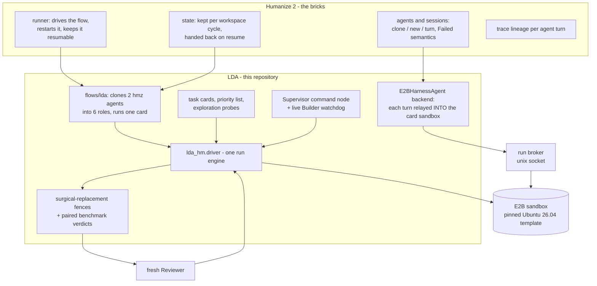
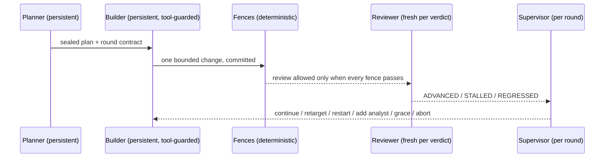

# LDA: Linux Development Agent

LDA lets long-running AI agents develop performance optimizations for Ubuntu
26.04 packages that install as drop-in replacements for the official ones.
The flow harness is Humanize 2 (`hmz`): its runner owns the loop, the agent
sessions, retries, resumable state, and run traces. This repository is a
flowverse that contributes everything LDA-specific on top of that harness -
the hard compatibility fences, the two-layer certified benchmarks, the task
cards, the package priority list, and the supervision rules. Every build,
test, benchmark, and agent turn executes inside E2B sandboxes created from
one pinned template; nothing runs on a bare host.

## The surgical-replacement boundary (the hardest fence)

An optimized package must be installable on a stock Ubuntu 26.04 system with
`dpkg -i`, and every existing binary, program, and development workflow must
keep working unmodified. That boundary is enforced mechanically, per
candidate, before any reviewer is consulted:

- **Shipped library set**: the candidate debs ship exactly the baseline's
  shared libraries - same names, no additions, no removals.
- **SONAME and ELF identity**: class, endianness, OS/ABI, machine, and type
  are equal; SONAME never changes.
- **Dynamic symbol table**: exported symbols and their versions are equal to
  stock, entry for entry.
- **Type-level ABI**: `abidiff` with debug info (dbgsym) reports no
  difference.
- **NEEDED set**: the candidate depends on the same libraries the baseline
  did.
- **Package relationship fields**: Package, Version, Architecture, Depends,
  Pre-Depends, Provides, Breaks, Conflicts are byte-equal, so apt treats the
  replacement exactly as it treats stock.
- **FFI proof**: a consumer binary compiled once against the baseline runs
  unmodified against the candidate with identical output.
- **Behavior**: every fixture decodes/renders/parses to byte-identical
  results through baseline and candidate.
- **Package lifecycle**: the candidate installs over stock on a live system,
  a compiled consumer still runs, and stock rolls back cleanly.
- **Security hardening**: RELRO, non-executable stack, no TEXTREL/RPATH, and
  Build IDs survive.
- **Upstream tests**: the package's own test suite runs during the candidate
  rebuild and the build log must prove it (a packaging that visibly disables
  its tests is recorded as not-applicable, never assumed to have passed).
- **autopkgtest**: the package's `debian/tests` run against the installed
  candidate; every test that passed on baseline must pass again.

A speedup never compensates for a fence failure.

## Certified results

Every number below is from paired in-sandbox benchmarks, held on a hidden
holdout the Builder never saw, re-certified in fresh sandboxes, with the full
ABI/FFI surgical-replacement fence suite green. Evidence lives in the run
directories under the results root.

| package | run | micro (train) | hidden holdout | end-to-end | how it was accelerated / why it works |
|---|---|---|---|---|---|
| libpng16-16t64 (pilot) | libpng-2604-production-008 | **+6.77%** decode | +6.76% | **+12.4%** cairo PNG-to-surface stack | SSE4.1 Paeth unfilter: the SSE2 multi-op abs/select emulation replaced with `pabsw`+`pblendvb`, plus an SSE2 Up-filter row (`-O2` never autovectorizes the byte loop). One-time CPUID dispatch, hidden symbols, SSE2 fallback kept - so SONAME, symbols, and abidiff are untouched and the deb stays drop-in. Faster because the same per-row recurrence retires in fewer uops on the target Xeon; byte-exact by construction (the blend mask comes from `cmpeq`). Replicated in 2 fresh sandboxes. |

Measured but **not yet certified** (run ended before certification - see the
top-10 table): libsoup-3.0-0 at +8.0% train / +7.4% hidden holdout on the
header-layer micro (forward-order list building without the
`g_slist_reverse` walk, and quality-list parsing without the intermediate
GSList+strdup churn; allocation-count-neutral, byte-identical output).

## Top-10 status (Ubuntu 26.04 desktop dependency graph)

The priority list is computed from the ISO's dependency graph (fan-in,
required out-degree, dependency surface, priority factor) - see
`data/candidates-ubuntu-2604.json`. Every top-10 candidate was explored with
measurements before any optimization was attempted; per-package evidence
sits in `explore/<package>/` under the results root. Verdicts as of
2026-08-31:

| # | package | score | status | what the evidence says |
|---|---|---|---|---|
| 1 | libgtk-4-1 | 71.50 | CARDED - run queued | the gi driver diluted attribution (~11% of cycles in libgtk-4), so the card uses a compiled dlopen workbench whose three inputs (CSS parse, selector match, full-tree layout) are gtk's own machinery by construction - probed deterministic and linearly scaling before the card opened |
| 2 | libgtk-3-0t64 | 69.42 | CARDED - run queued | same compiled workbench, gtk3 API variant; gtk3 style resolution costs ~6x gtk4's per iteration, which is exactly the in-package surface the card rewards |
| 3 | gnome-shell | 64.28 | falsified honestly | the frame loop lives in libmutter/clutter and JS in gjs; recompiling gnome-shell itself cannot move those hot paths |
| 4 | libreoffice-core | 63.34 | deferred: not operable per-round | headless convert-to-pdf is a ready e2e workload, but one candidate rebuild costs hours in-sandbox (56G build tree) |
| 5 | sssd-common | 60.69 | CARDED - run queued | headless proxy-files domain workbench: installed-mode A/B (dpkg -i + daemon restart outside the timed region), seeded NSS lookup schedules with a hidden holdout, fresh-process getent e2e |
| 6 | libcairo2 | 60.20 | measured negative so far | the first deck was mis-attributed (paint/mask are pixman's code, png-load is libz's); on the corrected cairo-owned deck (dashed-bezier stroking, self-intersecting fills, corpus text paths), re-enabling the LTO the packaging had disabled measured +1.38% summed - real but below the pre-registered 2% bar; `target_clones` stacked on LTO regressed (IFUNC defeats cross-TU inlining on serial scan-converter code). Next candidate needs a second mechanism on top of LTO. |
| 7 | gnome-settings-daemon | 59.67 | deferred: needs a session harness | most gsd plugins need a live session bus; only a startup subset is measurable headlessly |
| 8 | gstreamer1.0-plugins-good | 59.55 | falsified for decode | perf shows 90.3% of decode cycles in the external codec (libvpx); the package's own demux/parse share is under 3% |
| 9 | ibus | 57.77 | deferred: needs an input fixture | a truthful key-roundtrip benchmark needs a focused window and synthetic input events |
| 10 | libsoup-3.0-0 | 54.01 | mechanism proven, re-run queued | header parsing (quality lists, params, case-insensitive lookups) is string-heavy `-O2` code entirely inside the package; the run measured +8.0% train / +7.4% hidden holdout with byte-identical output, then ended on a trace-audit false positive (prose was being scanned; fixed - the audit now reads only executed actions) before certification could run |

## Flow architecture

LDA is a [Humanize 2](https://github.com/humanfia/humanize2) flowverse: the
generic agent machinery is hmz's bricks, and everything in this repository
is the domain layer built out of them. The split is what keeps the flow easy
to maintain and extend - the loop, session lifecycle, resume, and trace
lineage never have to be re-engineered here, so adding a package family is a
workbench script plus a card profile, and swapping the agent backend or
model is a flag, not a rewrite.



Concretely: `flows/lda/__init__.py` is a resumable hmz flow that receives
two hmz agents (a builder side and a reviewer side) and hmz's kept `state`
dict; it clones them into the six LDA roles (drafter/planner/builder,
analyst/reviewer/supervisor - persistent writers, fresh readers) and drives
one task card. The agent backend is a `CommandSessionBase` implementation,
so to hmz an in-sandbox LDA turn is just another agent turn: model
credentials stay sandbox-resident, one relay process per turn, and
`hmz trace collect` sees the whole run. LDA's own contribution is everything
Ubuntu-specific around that skeleton: the drop-in-replacement fences, the
noise-hardened paired benchmarks, the anti-cheat boundary, the priority
analysis, and the supervision rules.

Roles and independence (persistent writer, fresh reader):



One run of a card:

1. **Explore** (before any card): `lda explore <package>` measures a stock
   workload in a fresh sandbox, attributes cycles with perf, and writes an
   honest feasibility verdict - including falsification when the hot code
   lives in another package.
2. **Setup**: sandbox from the pinned template; the recorded APT snapshot is
   the only package source; the installed set is aligned to the snapshot;
   the exact source version is fetched and committed as the baseline; the
   fence self-checks must flag known-bad samples before any verdict is
   trusted.
3. **RLCR rounds**: a persistent Builder makes one bounded change per round
   (an in-turn tool guard blocks evidence tampering as it happens); fences
   and paired benchmarks judge the round; a fresh Reviewer rules on the
   evidence; the Supervisor steers.
4. **Finalize**: the whole result replays in fresh sandboxes from the
   immutable template - setup from the snapshot, patch re-applied, all
   fences re-run, fresh-seed holdout - before anything is called certified.

## Benchmarks on a noisy multi-tenant host

E2B sandboxes share hosts with other tenants, so the benchmark policy is
designed to make noise visible and non-exploitable rather than to pretend it
away:

- all timing is taken inside the sandbox by the workload script and tagged
  with a per-invocation nonce the measured process cannot see; host wall
  time is never judged;
- baseline and candidate alternate within one sandbox, per repetition, so
  host drift cancels inside each pair;
- one repetition runs for seconds, not tens of milliseconds - process
  start-up and scheduler jitter must be negligible next to the effect;
- a speedup certifies only when the 95% Student-t interval on per-repetition
  log ratios excludes 1.0, the declared minimum is cleared, and fewer than
  three repetitions never certify;
- co-tenant CPU steal above 10% of any sample invalidates the run itself
  (one retry, then an infrastructure block - the candidate is not blamed);
  a spread wildly out of proportion to the effect is treated the same way;
- the micro inputs the Builder can see are the train set; certification also
  requires the declared margin on a hidden holdout generated from a
  host-held seed;
- before certification is trusted on a host, the baseline is measured
  against itself (an A-A null run): a harness that resolves an effect where
  none exists is a false-positive generator and its verdicts are refused;
- finalize replays everything in fresh sandboxes that land on other hosts,
  so a speedup that only existed on one machine does not certify.

Measurement capability of the sandboxes (probed, recorded per run): the
Firecracker guests expose no PMU - `cycles` is unsupported - so profiling
uses software sampling (`linux-perf` from the pinned snapshot); the target
CPU reports the full AVX-512/AMX flag set, and architecture-specific work
targets those flags with runtime dispatch (`target_clones`) so the package
stays correct on any x86-64 host.

## Supervision (the command layer)

Authority is fixed: human control file > deterministic rules > LLM counsel.

- A live watchdog reads the Builder's growing trace during a turn, mirrors
  it to the host (so an agent cannot rewrite its own history), and kills a
  stalled agent process after double confirmation - a watchdog that cannot
  observe never kills. Every turn is also wall-clock bounded inside the
  sandbox, so a runaway agent process cannot outlive its relay.
- Between rounds the Supervisor assembles a pulse from the run's own
  evidence (verdicts, blocks, benchmark trend, trace statistics, sandbox
  load, spend) and emits one auditable decision: continue, retarget,
  restart the Builder, add an independent Analyst, grant a one-per-run
  grace for an improving near-miss, or abort.
- `<run>/control.json` is the human channel, re-read at every phase
  boundary: `{"action": "abort"}`, `{"contract": "..."}`,
  `{"action": "restart_builder"}`.
- Infrastructure failures never count against the candidate. A Builder turn
  killed by a model-gateway outage, a Reviewer answer that is a transport
  error, an unstable benchmark window - each is recorded as an
  infrastructure block that consumes no stall budget and no iteration
  budget. Three in a row pause the run (state saved, sandbox released,
  resumed by the driver loop) instead of ending it: an outage that lasts an
  afternoon must not lose a card.
- The Builder-trace audit judges what the agent **did** - executed commands
  and edited paths - never what it said: prose legitimately quotes the very
  patterns a cheating command would contain. A session whose trace fails
  audit is replaced with a fresh session (clean trace, stall retained).

## Quick start

```bash
git clone -b LDA-HM https://github.com/yisun219/Linux-Development-Agent-Flow.git lda && cd lda

# one-time: the hmz virtualenv (Python >= 3.12) and this repository
uv venv --python 3.12 ~/.venvs/ldahm
uv pip install --python ~/.venvs/ldahm/bin/python \
  "git+https://github.com/humanfia/humanize2.git" e2b
uv pip install --python ~/.venvs/ldahm/bin/python -e .
alias lda="PYTHONPATH=$PWD/src python3 -m lda_hm.cli"

# E2B access, kept out of the repository in ~/.config/lda-hm/e2b.env (0600):
#   E2B_API_URL=...  E2B_SANDBOX_URL=...  E2B_API_KEY=...
# The file is loaded automatically whenever a sandbox is created.
python sandbox/build_template.py     # build the lda-base template once

# Agent credentials for the in-sandbox CLIs, exported in the shell that
# starts a run (they are injected only when a sandbox boots; the relay
# processes never carry them):
export ANTHROPIC_BASE_URL=... ANTHROPIC_AUTH_TOKEN=...

# explore a ranked candidate (no agent turns, measurements only)
lda explore libsoup-3.0-0 --results-root ~/lda-runs

# open a card and run the full flow under the hmz harness
lda gen-card libsoup-3.0-0 --out examples/libsoup3-card.json
lda init-card ~/lda-work-soup examples/libsoup3-card.json
LDA_RESULTS_ROOT=~/lda-runs bin/lda-hmz-drive ~/lda-work-soup soup-production-001
```

Interrupting a run loses nothing: starting the same command again resumes
from the kept state (the driver loop in `bin/lda-hmz-drive` already does
this, and an infrastructure outage parks the run instead of ending it).
`<run>/control.json` steers a live run, `LDA_BUDGET_USD` caps spend,
`LDA_CERT_REPLICATIONS` sets fresh-sandbox certification replications,
`LDA_TURN_TIMEOUT` bounds one agent turn, and `lda trace <run-dir>` renders
a run's behavioral timeline. `tools/e2b/reap-sandboxes.py` collects
sandboxes that a SIGKILL'd driver could not release.

## Repository layout

```text
flows/lda/           the flow the hmz runner executes
src/lda_hm/
  driver.py          one run engine shared by both entry points
  hmz_backend.py     hmz agent backend: turns relayed into the sandbox
  hmz_relay.py       one relay process per agent turn
  broker.py          the flow process lends its sandbox connection
  execution.py       E2B lifecycle, integrity pinning, certification
  fence.py gates.py  deterministic boundary before any reviewer
  benchmark.py       paired statistics, nonce samples, Student-t policy
  supervision.py     Supervisor rules, run pulse, Builder watchdog
  explore.py         pre-card feasibility probes for ranked packages
  cardgen.py         task-card generator for profiled candidates
sandbox/lda-base/    template recipe: Dockerfile, checks, harness, skills
examples/            generated task cards (libpng pilot, cairo, soup, gtk3/4, sssd)
data/                ranked top-30 candidates from the ISO dependency graph
tests/               engine and card tests (no model calls)
```

The skills shipped into every sandbox (`sandbox/lda-base/skills/`) follow
the `<name>/SKILL.md` layout and are linked into the agent's skill path at
bootstrap, so the Builder actually loads them: the LDA fence/benchmark/
review contracts, the measured libpng lessons (with the validated patch),
and the pinned Intel performance skills (linux-perf flows,
performance-patterns, phoronix-test-suite).

## Development

```bash
python -m unittest discover -s tests -v
```
