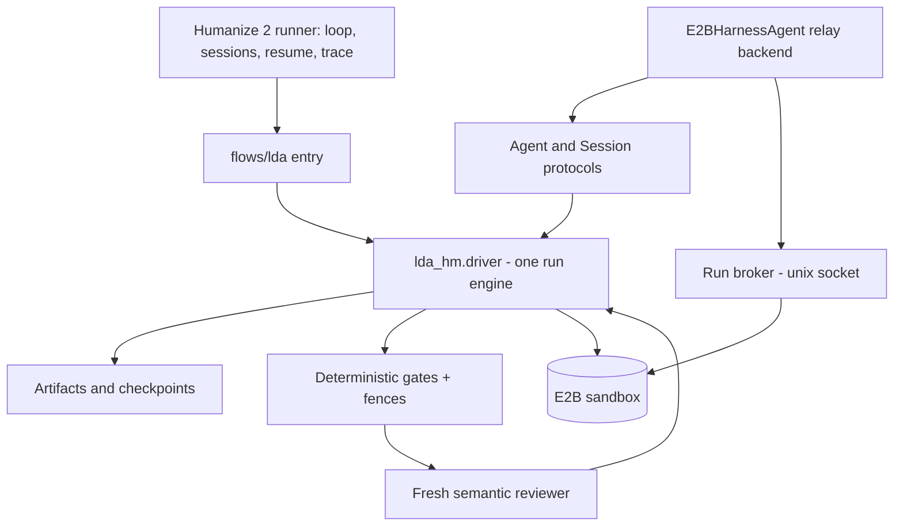
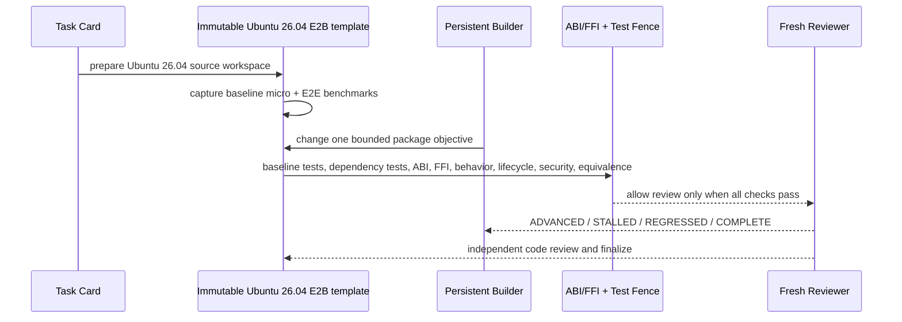
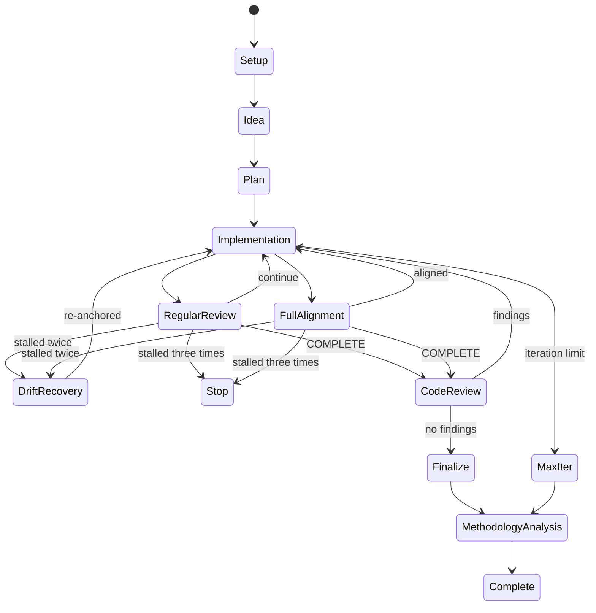

# LDA-HM Flow

## Scope

The flow harness is Humanize 2 (`hmz`): the loop, sessions, retries,
resumable state, and run traces belong to the hmz runner, and this repository
contributes only what is LDA-specific - the task-card contract, the
deterministic fences, the paired benchmark policy, the supervision rules,
and the E2B execution adapters. hmz is the brick, LDA is the building: the
generic machinery is never re-engineered here, which is why extending the
flow to a new package family is a workbench script plus a card profile, and
swapping the agent backend or model is a flag. The flowverse entry is `flows/lda`; both
entry points below share one engine (`lda_hm.driver`), so they cannot drift:

- `bin/lda-hmz run <workspace>` - production path: the hmz runner drives
  the flow; every agent turn is relayed into the card sandbox by the
  `E2BHarnessAgent` backend (`lda_hm/hmz_backend.py`, one relay process per
  turn through the run broker).
- `lda run <workspace>` - the same engine driven directly (used by tests
  and by environments without the hmz virtualenv).

Either way the run creates or resumes an E2B execution, overlays the
checked-in harness and skills, aligns the sandbox package set to the pinned
snapshot, prepares the pinned Ubuntu 26.04 source workspace, captures paired
baseline measurements, and then runs the persistent Builder / fresh Reviewer
loop. A missing E2B sandbox or missing Agent provider credential is a hard
error; there is no host-shell fallback.

Before any card is opened, `lda explore <package>` runs the evidence-based
feasibility probe for a ranked candidate: stock packages from the snapshot,
a package-relevant workload timed by the in-sandbox nonce timer, perf
attribution where the sandbox allows it, and an honest verdict (including
falsification) recorded under the results root.

## Layers

For an LDA package card the execution path is:

The backend owns model transport and session execution. The flow owns roles,
phase transitions, prompts, state, and termination. Deterministic gates reject
mechanically invalid work before an LLM reviewer is consulted.

## Session topology

- Drafter: one persistent session while producing an idea draft.
- Planner: one persistent session while revising a candidate plan.
- Analyst: a fresh session for each independent plan reading.
- Builder: one persistent session within an execution run.
- Reviewer: a fresh session for every regular, alignment, or code review.
- Human: owns decisions that the flow cannot safely infer.

The writer keeps context because it must continue unfinished reasoning. The
reader starts fresh because independence is part of the review boundary.

## State machine

## Durable artifacts

Each run is stored below `<results-root>/runs/<run-id>/`. By default,
`results-root` is the package workspace's `.lda-hm` directory. Production runs
set `--results-root` or `LDA_RESULTS_ROOT` to a dedicated result repository so
flow source, package source, and execution evidence have separate histories.
The state file is written atomically whenever a transition succeeds. The flow
never treats a transcript as its state; backend logs and flow checkpoints have
different responsibilities.

The result repository tracks small reviewable artifacts: state, plans, round
contracts and summaries, fence results, benchmark summaries, digests, and
external artifact references. ISO images, SquashFS files, Debian packages,
credentials, and large raw traces remain in external artifact storage and are
referenced by immutable digest.

Core artifacts are:

- `idea.md`
- `plan.md` and `plan.sha256`
- `goal-tracker.md`
- `rounds/<n>/contract.md`
- `rounds/<n>/summary.md`
- `rounds/<n>/review.json`
- `rounds/<n>/bitlesson.json`
- `finalize-summary.md`
- `methodology-report.md`
- `state.json`
- `benchmarks/` - every paired report, including the breakdown of a FAILED
  verdict (`benchmark-summary.json` carries `verdict_error` so the
  Supervisor, the Analyst, and the next round localize from per-input
  numbers, not from one error sentence)
- `assets-snapshot/` - the run's own pinned copy of the sandbox assets
  (harness, checks, skills, baseline identity), captured at first setup;
  every resume and certification bootstraps from it, so repository
  evolution between rounds cannot invalidate a live run's integrity pin

## Supervision layer

Supervision exists at three timescales, with fixed authority: human control >
deterministic rules > LLM counsel.

1. Live (during a Builder turn): `BuilderWatchdog` polls the size of
   `/opt/lda/agent-state` inside E2B. A turn whose activity stops growing for
   `builder_stall_minutes` is double-confirmed and then killed, so a hung
   agent surfaces as a failed round instead of a silent hour. A watchdog
   that cannot observe never kills. Independently, the in-sandbox harness
   bounds every agent turn at `LDA_TURN_TIMEOUT` wall seconds (the relay's
   own deadline is longer), so a runaway agent process is killed inside the
   sandbox and never left running behind a relay that gave up on it. A
   failed Builder turn does not crash the flow - and it is never judged:
   see the infrastructure split below.
2. Between rounds: the `Supervisor` node assembles a `RunPulse` from the
   run's own evidence (round verdicts, blocked reasons, benchmark trend,
   Builder trace statistics with cost, sandbox load and disk, cumulative
   spend) plus the human `control.json`, and emits one auditable
   `SupervisorDecision` per round, stored at `rounds/<n>/supervision.json`.
   Actions: continue, retarget (rewrites the next round contract),
   restart_builder (fresh Builder session for a dead/poisoned one),
   consult_analyst (adds an agent: a fresh independent Analyst whose
   diagnosis is appended to the next contract - granted once per stall
   streak when drift recovery begins), grant_grace (one-per-run stall
   forgiveness for an improving near-miss; rules-only), abort.
   Deterministic rules cover budget exhaustion, repeated same-fence failures,
   and dead Builder sessions; an LLM supervisor session is consulted only
   when the run is off-track, its answer is parsed under a strict
   ACTION/CONTRACT/REASON protocol, a malformed answer degrades to the rule
   decision, and an LLM abort is demoted to retarget - only humans and hard
   rules may end a run.
3. Evidence split: infrastructure failures never count against the
   candidate's idea. An interrupted Builder turn (dead relay, watchdog
   kill, or a model-gateway error printed as the "answer" - the harness and
   the flow both recognize those), a Reviewer answer that is a transport
   error, an unstable benchmark window, a dead sandbox - each is recorded
   as an infrastructure block (`blocked.json` with `infra: true`) that
   consumes neither the stall budget nor the iteration budget
   (`productive_rounds` excludes them), and no fence or benchmark judges
   the half-finished state such a turn leaves behind; the next round's
   contract tells the Builder the turn was interrupted and to inspect
   `git status`. Three consecutive infrastructure blocks raise
   `InfrastructureOutage`: the run pauses (state saved at the next
   implementation round, sandbox released, exit code 75) and the driver
   loop resumes it when the platform recovers - an outage can delay a card,
   never end one.

## Benchmark verdict policy

All timing comes from in-sandbox `LDA_BENCH` samples; host wall time is never
judged. A paired run alternates baseline/candidate order per repetition in one
sandbox, then:

- CPU steal above 10% of any sample invalidates the run itself (one retry,
  then an infrastructure block - the candidate is not blamed).
- A regression beyond the per-input limit is a veto.
- A speedup certifies only if it clears the declared minimum, exceeds the
  half-range noise, and its 95% Student-t interval on per-repetition log
  ratios excludes 1.0. Fewer than three repetitions never certify.
- The hidden holdout (fixtures from a host-held secret seed the Builder has
  never seen) must independently clear its own minimum.

## Fresh-sandbox certification (A/B/A')

Finalize replays the whole result in `LDA_CERT_REPLICATIONS` fresh sandboxes
built from the immutable template: verify baseline identity, run setup from
the pinned snapshot, apply the durable `candidate.patch`, run every fence
(trace fence not applicable - no Builder ran there), and re-run all paired
benchmarks plus a fresh-seed holdout. This is the hard guarantee against both
benchmark placement noise (each sandbox lands on its own host) and Builder
sandbox tampering (nothing from the Builder environment survives except the
git patch). Results land in `benchmarks/certification/` and
`certification-summary.json`.

## Integrity pinning

After setup, the harness, baseline, and fixture directories are root-sealed
and digest-pinned into `integrity-manifest.sha256` (host side). Every
benchmark run and every fence pass first re-sweeps those directories with a
host-composed command and refuses to judge anything if pinned content
changed. The Builder has sandbox sudo, so sealing is a speed bump and the
manifest is a tripwire; fresh-sandbox certification is the actual guarantee.

## Gate boundary

The gate order is fixed. A semantic reviewer runs only after all applicable
deterministic gates pass:

1. state schema
2. branch anchor
3. plan integrity
4. open blocking tasks
5. git status availability
6. large changed files
7. methodology phase
8. clean worktree
9. unpushed commits
10. round summary
11. round contract
12. BitLesson delta
13. goal tracker
14. maximum iterations
15. finalize completion

In addition to these control gates, every package card has hard compatibility
fences and two-layer paired benchmarks. Three fence families are
non-negotiable: the package's own acceptance tests (the candidate rebuild
must prove in its build log that dh_auto_test ran - or that the packaging
visibly disables it - and the package's autopkgtest suite must not regress
against the baseline reference recorded at setup), the ABI/FFI
surgical-replacement suite, and the Builder-trace audit (the harness appends
every turn to a cumulative stream-json trace inside the sandbox, mirrored
live to the host by the watchdog, and required by the trace fence before any
verdict). The trace audit judges recorded ACTIONS - executed commands,
edited paths - never prose: assistant text and quoted contracts legitimately
mention the very patterns a cheating command would contain, and because the
trace is cumulative a prose match would fail every later round with no way
back. When a session's trace does fail audit, the Supervisor replaces the
Builder with a fresh session (clean trace; the stall stays on the counter).
A Reviewer verdict is parsed from the closing protocol block of its answer,
so a reviewer that restates the protocol while reasoning is not mistaken
for a malformed one. Setup also aligns every
installed package to the pinned snapshot's version (the template carries
newer security updates; the apt solver only honors explicit downgrades), so
build-dependencies and stock installs resolve exactly as an ISO-era system
would. A speedup never compensates for an ABI,
FFI, behavior, package lifecycle, security, result-equivalence, or trace audit
failure. Benchmark regression limits are explicit per workload and account for
measurement noise; they are guardrails, not proof that an optimization achieved
its acceptance target. Production cards may also set a minimum speedup; the
libpng micro workload requires 2% before semantic review is allowed.

Run recovery is artifact-based. A new E2B Sandbox bootstraps from the run's
`assets-snapshot`, reconstructs the pinned baseline commit, reapplies
`candidate.patch`, restores the untracked raw Builder trace used by the trace
fence, and resumes a pending regular or full-alignment review. The run
identity rejects task-card or baseline changes under an existing run ID.
Heavyweight cards raise the per-command setup and fence ceilings with
`LDA_SETUP_TIMEOUT` and `LDA_FENCE_TIMEOUT`; judged benchmark timeouts stay
in the card.
