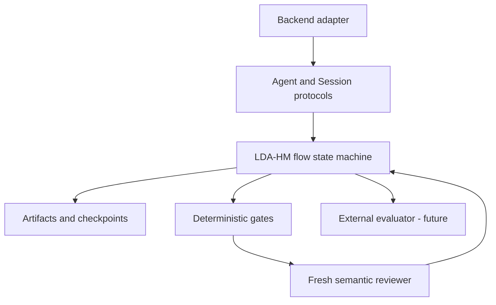
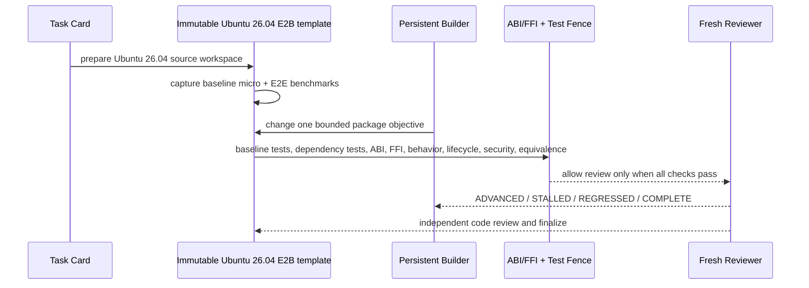
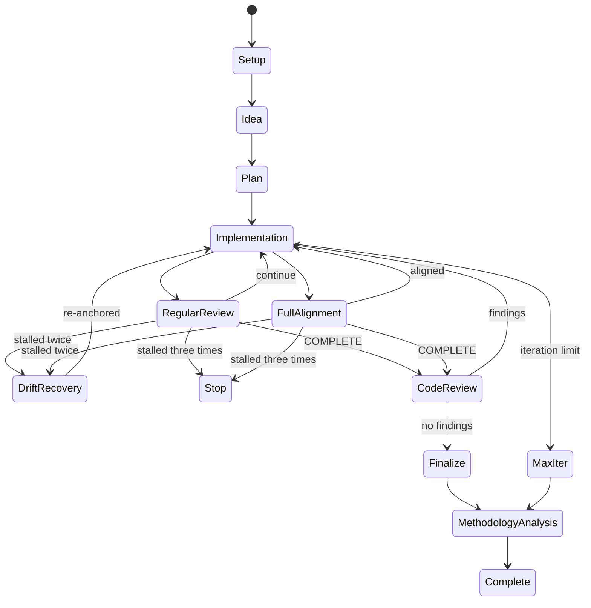

# LDA-HM Flow

## Scope

This repository contains a new flow implementation. It borrows architectural
ideas from Humanize but owns its state format, artifacts, prompts, and future
autoresearch adaptations.

The production entry point is `lda run`. It creates or resumes an E2B
execution, overlays the checked-in harness and skills, prepares a pinned Ubuntu
26.04 source workspace, captures paired baseline measurements, and then runs
the persistent Builder / fresh Reviewer loop. A missing E2B sandbox or missing
Agent provider credential is a hard error; there is no host-shell fallback.

## Layers

For an LDA package card the execution path is:

The backend owns model transport and session execution. The flow owns roles,
phase transitions, prompts, state, and termination. Deterministic gates reject
mechanically invalid work before an LLM reviewer is consulted.

## Session topology

- Drafter: one persistent session while producing an idea draft.
- Planner: one persistent session while revising a candidate plan.
- Analyst: a fresh session for each independent plan reading.
- Builder: one persistent session within an execution run.
- Reviewer: a fresh session for every regular, alignment, or code review.
- Human: owns decisions that the flow cannot safely infer.

The writer keeps context because it must continue unfinished reasoning. The
reader starts fresh because independence is part of the review boundary.

## State machine

## Durable artifacts

Each run is stored below `<results-root>/runs/<run-id>/`. By default,
`results-root` is the package workspace's `.lda-hm` directory. Production runs
set `--results-root` or `LDA_RESULTS_ROOT` to a dedicated result repository so
flow source, package source, and execution evidence have separate histories.
The state file is written atomically whenever a transition succeeds. The flow
never treats a transcript as its state; backend logs and flow checkpoints have
different responsibilities.

The result repository tracks small reviewable artifacts: state, plans, round
contracts and summaries, fence results, benchmark summaries, digests, and
external artifact references. ISO images, SquashFS files, Debian packages,
credentials, and large raw traces remain in external artifact storage and are
referenced by immutable digest.

Core artifacts are:

- `idea.md`
- `plan.md` and `plan.sha256`
- `goal-tracker.md`
- `rounds/<n>/contract.md`
- `rounds/<n>/summary.md`
- `rounds/<n>/review.json`
- `rounds/<n>/bitlesson.json`
- `finalize-summary.md`
- `methodology-report.md`
- `state.json`

## Gate boundary

The gate order is fixed. A semantic reviewer runs only after all applicable
deterministic gates pass:

1. state schema
2. branch anchor
3. plan integrity
4. open blocking tasks
5. git status availability
6. large changed files
7. methodology phase
8. clean worktree
9. unpushed commits
10. round summary
11. round contract
12. BitLesson delta
13. goal tracker
14. maximum iterations
15. finalize completion

In addition to these control gates, every package card has hard compatibility
fences and two-layer paired benchmarks. A speedup never compensates for an ABI,
FFI, behavior, package lifecycle, security, result-equivalence, or trace audit
failure. Benchmark regression limits are explicit per workload and account for
measurement noise; they are guardrails, not proof that an optimization achieved
its acceptance target. Production cards may also set a minimum speedup; the
libpng micro workload requires 2% before semantic review is allowed.

Run recovery is artifact-based. A new E2B Sandbox reconstructs the pinned
baseline commit, reapplies `candidate.patch`, restores the untracked raw Builder
trace used by the trace fence, and resumes a pending regular or full-alignment
review. The run identity rejects task-card or baseline changes under an existing
run ID.
