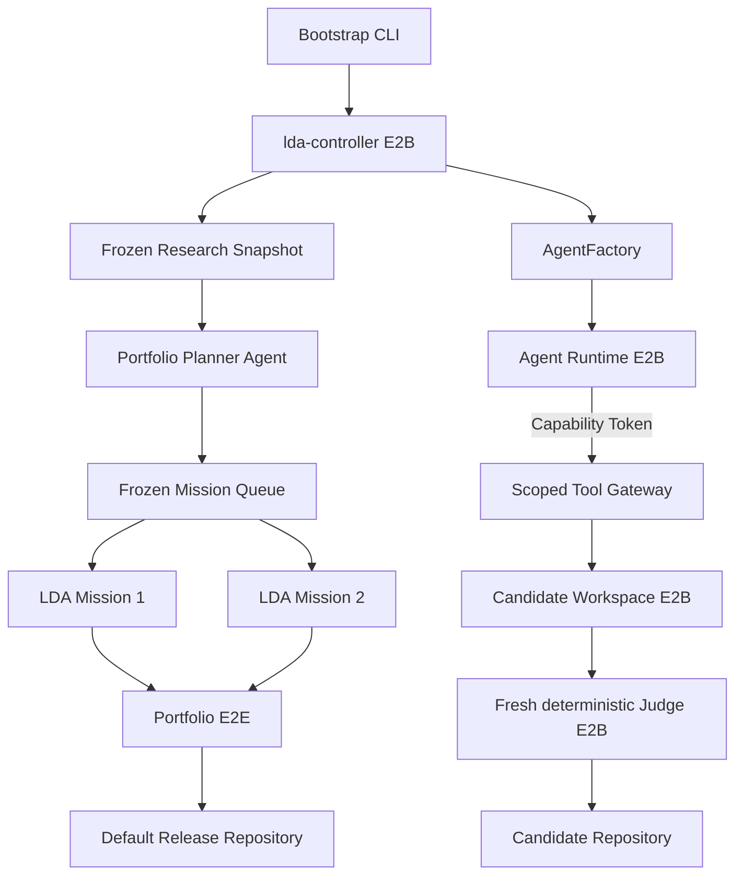
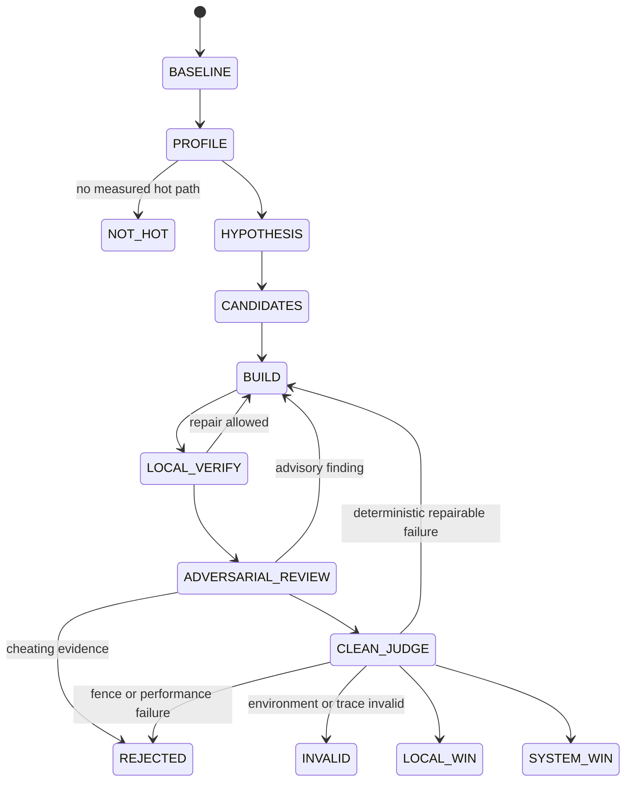

# Pure Humanize Flow

The Bootstrap creates the Controller and its persistent E2B Volume. It is not an
execution fallback. After bootstrap, only the Controller holds E2B credentials.
All source operations are performed in Workspace Sandboxes through scoped Tool
Gateway calls. All acceptance checks run from scratch in Judge Sandboxes.

## Mission state

The Builder maintains one Codex thread for a Candidate. Each Reviewer and Trace
Auditor is a new thread and cannot access Builder conversation. Agent messages
never grant completion. Candidate acceptance is a `JudgeResult` derived from
fixed commands and benchmark policy.

## Persistent artifacts

- Research Snapshot and Mission Queue are frozen content-addressed objects.
- Mission Contract seals official source/deb hashes, paths, manifests, hardware,
  tests, workloads, budget, and acceptance policy before Builder access.
- SQLite stores the recoverable state snapshot.
- JSONL stores the append-only event history.
- E2B Volume stores state across Controller replacement.
- Candidate patches, traces, test results, benchmark samples, and Judge results
  are immutable objects referenced by SHA-256.

## Compatibility order

Judge executes SONAME, exported symbol, symbol version, `abidiff`,
`abi-dumper`/`abi-compliance-checker`, header compilation, public layout,
calling convention, pkg-config, CMake metadata, install paths, precompiled
binary, ctypes, cffi, Rust FFI, dlopen/dlsym, C/C++ source compatibility, and
Debian dependency relationship checks. Any failure ends performance evaluation.

## Benchmark policy

Micro and E2E commands must emit the `BenchmarkSeries` schema. The Controller
rejects fewer than ten warmups or thirty paired samples, nonpositive samples,
unpaired sequences, excessive coefficient of variation, insufficient micro
speedup, insufficient CI lower bound, and E2E regression. Portfolio release
requires at least two improved E2E workloads and a 1.01 geometric mean speedup.
