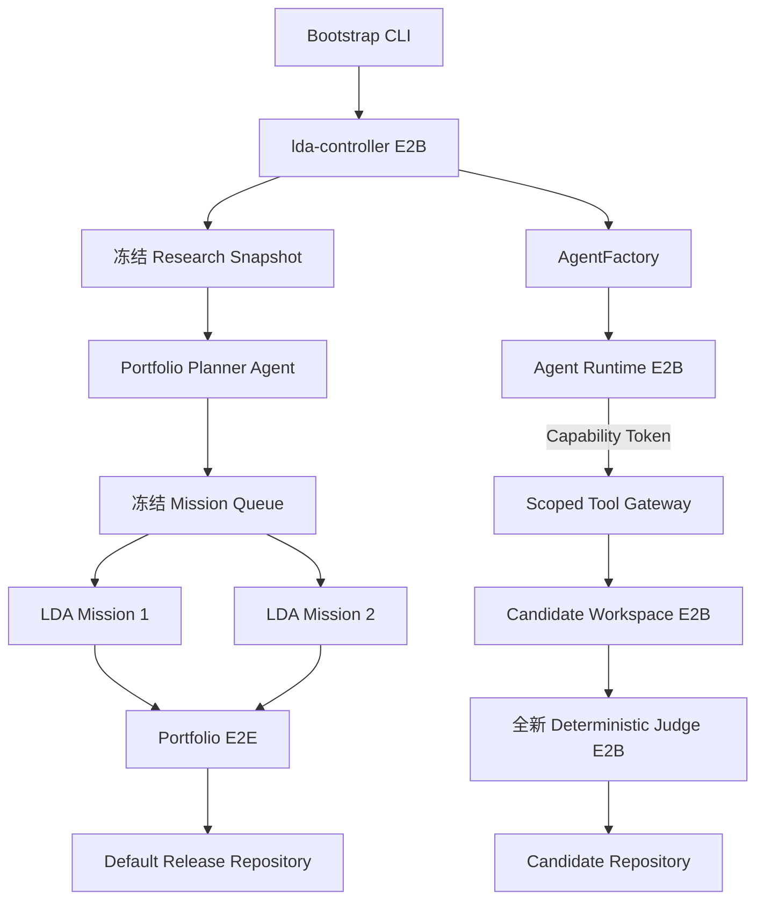
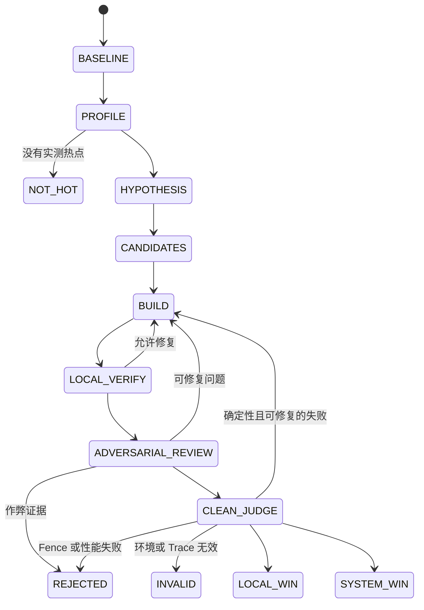

# Linux Development Agent Flow

本文描述当前 `LDA-HM` 分支实际执行的生产 Flow。README 给出整体介绍，本文重点说明控制边界、Mission 状态和持久化数据。

## 分层架构



Bootstrap 只负责创建 Controller 和持久化运行空间，不是执行 fallback。启动完成后，只有 Controller 持有 E2B 凭据。Agent Runtime 只能通过带作用域、短生命周期的 Capability Token 操作自己的 Workspace；源码准备、构建、测试、Profile 和 Benchmark 都在 E2B Sandbox 中完成。

Judge 不使用模型，也不信任 Builder 的本地验证结果。它在全新 Sandbox 中重新取得固定 Ubuntu Snapshot 的官方源码和 `.deb`，核对 Mission Contract 的哈希，应用 Candidate Patch，从头构建并运行固定 Fence。

## Run 状态

```text
RUN_CREATED
-> E2B_PREFLIGHT
-> RESEARCH_FROZEN
-> PORTFOLIO_PLANNED
-> MISSION_QUEUE_FROZEN
-> MISSION_BASELINE
-> PROFILE
-> HYPOTHESIS
-> CANDIDATE_FORK
-> BUILD
-> LOCAL_VERIFY
-> ADVERSARIAL_REVIEW
-> CLEAN_JUDGE
-> LOCAL_WIN | SYSTEM_WIN | REJECTED | INVALID
-> NEXT_MISSION
-> PORTFOLIO_E2E
-> RELEASE_READY | COMPLETED_WITHOUT_RELEASE
```

Research Snapshot 和 Mission Queue 在 Run 开始阶段冻结。当前 Run 不能新增普通 Mission，只能在单个 Mission 内创建有限数量的 Candidate 和修复尝试。`libcairo2` 与 `libsoup-3.0-0` 是 Canary barrier；两者到达终态前，其余八个 Mission 不会进入执行阶段。

## Mission 状态



Builder 为每个 Candidate 保持一个可恢复的 Codex thread。每一轮 Reviewer 和 Trace Auditor 都使用全新 thread，不能读取 Builder 对话、修改源码或改变验收状态。Agent 声称完成不会终止流程；Candidate 状态只由确定性 Judge 结果和 `ConvergenceEvaluator` 改变。

## Judge 顺序

Judge 按固定顺序执行，前一层失败后不会继续计算性能收益：

1. Level 0：官方 upstream self tests。
2. Level 1：ABI、API、FFI 与 Debian package compatibility。
3. Level 2：原有预编译 binary 加载 Candidate library。
4. Level 3：直接 reverse dependency 的 build/test。
5. Level 4：高优先级应用的 install、launch 和 smoke。
6. Level 5：Chrome、Web server、GUI 等 E2E guardrail。

兼容性 Fence 包括 SONAME、exported symbol、symbol version、`abidiff`、`abi-dumper`、`abi-compliance-checker`、header compile、公开类型布局、calling convention、pkg-config、CMake metadata、安装路径、预编译 consumer、ctypes、cffi、Rust FFI、`dlopen`/`dlsym`、C/C++ source compatibility 和 Debian dependency relationship。

## Benchmark 与验收

Micro Benchmark 至少执行 10 次 warmup 和 30 对随机化 A/B 样本，保存原始样本、固定随机种子和 CPU/NUMA 环境，使用 paired ratio 与 bootstrap 95% CI。默认要求速度提升至少 3%，CI lower bound 至少 1%。

Micro 结果只决定局部 Candidate reward。`LOCAL_WIN` 必须通过全部 Fence 且 E2E 回退不超过 0.5%；`SYSTEM_WIN` 还必须对目标 E2E workload 有显著贡献。默认 release 由最终 Portfolio E2E 决定，要求几何平均至少提升 1%，并至少改善两个 E2E workload，不能把多个 Micro speedup 直接相加。

## 持久化与恢复

- Research Snapshot、Mission Queue 和 Mission Contract 是不可变 content-addressed object。
- SQLite 保存可事务恢复的当前状态，JSONL 保存 append-only 事件历史。
- Candidate Patch、Trace、测试、Benchmark 样本、Judge 结果和 `.deb` 通过 SHA-256 引用。
- Sandbox 使用确定性 `lease_id`；创建请求结果不确定时，Controller 先按 metadata 查找已有实例。
- `lda resume` 从冻结 request 恢复 Controller、Workspace lease 和 Builder thread，不会重新规划 Mission Queue。
- Research、队列、官方 baseline 或 Contract 改变时必须创建新 Run。

生产环境优先使用 E2B Volume。兼容网关没有 Volume API 时，Controller filesystem 是显式持久化位置；这不是本地或 Docker fallback。
